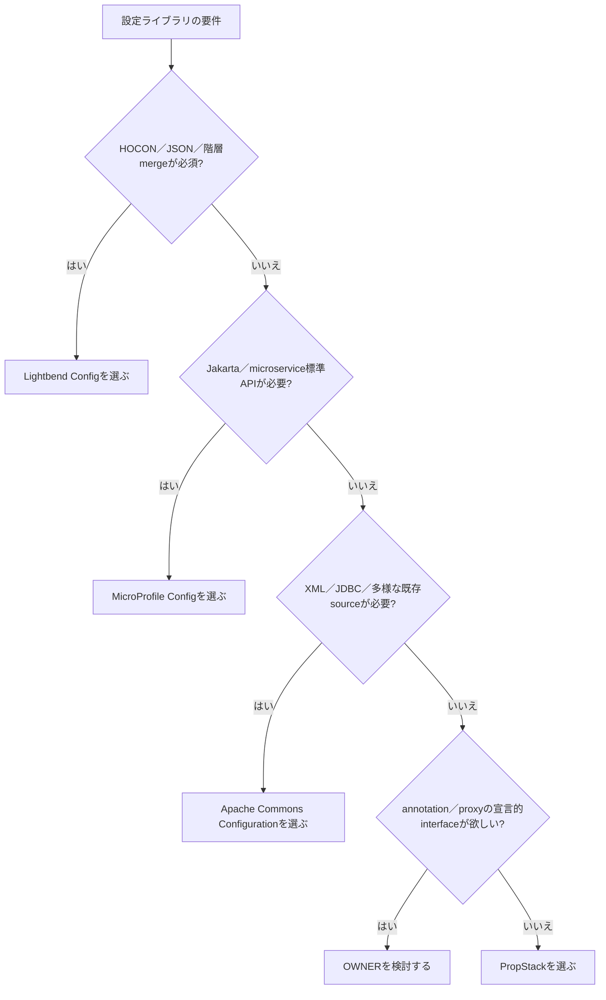

# PropStack 市場調査

調査日: 2026-07-31。比較対象のstar数・リリース日は同日参照。コードと自repoの実測も同日に実施した。

## 0. 要約

立ち位置: Java 21+ の小規模アプリ向けに、依存ゼロで設定の型安全性と起動時診断をまとめるライブラリ。

最大の弱点: HOCON／JSON、階層設定、動的再読み込み、標準仕様互換では先行ライブラリに大きく及ばず、採用理由がREADME上の主張に留まる。

次の一手: `TypedKey` を中心に未知キー・変換失敗・secret漏えいを一貫して検査する最小APIを固め、実測可能な導入例とMaven配布を整える。

## 1. このrepoは何か

PropStack は Java 21+ の設定解決ライブラリである。`PropStack` が programmatic override、JVM system property、環境変数、ユーザーのホーム配下、classpath の properties を優先順位付きで読む。`PropertySource` を実装すれば入力源を差し替えられ、`${VAR}` 展開、文字列からの基本型変換、必須値取得を提供する。

設定の価値は単体で完結する。想定利用者は Spring／Jakarta EE の導入を避けたい小規模 Java アプリ、CLI、テストコードである。`Registry` は同じartifactに含まれる名前付き・型付きのコンポーネント置き場だが、設定解決とは別の補助機能であり、比較の主単位には含めない。実際の利用フローは「アプリが `PropStack` を生成し、必要なら手作業でコンポーネントを生成して `Registry` に置く」である。

到達点をコードとビルドから確認した。main の Java ソースは 1,084 行、test は 1,463 行、テストクラスは10個、`mvn test -q` は成功、実行時依存は0、生成済み `target/propstack-0.9.1.jar` は25,106 bytesだった。`pom.xml` は Java 21、MIT、revision 0.9.2を示す一方、作業ツリーの生成物は0.9.1であり、公開版表示には整合確認が要る。

READMEには「No other config library has this」とあるが、これは比較対象全体を網羅した事実ではないため採用根拠にはしない。ここではコードで確認できるAPIと、先行例の公開仕様を比較する。

## 1.5 調査の型

`target_type: library`。PropStackはJavaライブラリとしてAPIを呼び出して使い、コード・テスト・依存・jarサイズを読めるため、機能だけでなく実装の軽さ、状態の持ち方、拡張点、入力の手間を比較する。

## 2. 比較対象と選定理由

| 製品 | 何ができるか | 採用状況（2026-07-31参照） | ライセンス | うちとの決定的な違い | なぜ選んだか |
|---|---|---|---|---|---|
| [Lightbend Config](https://github.com/lightbend/config) | HOCON／JSON／propertiesの読込、階層・include・substitution、型変換、immutable Config | ★6,300、最新表示1.4.4。GitHub上で機能完成品として保守 | Apache-2.0 | 階層・HOCON・immutable mergeが強い。PropStackはflat propertiesと診断が軽い | JVMで広く使われる、依存ゼロの直接競合 |
| [Apache Commons Configuration](https://github.com/apache/commons-configuration) | properties、XML、INI、plist、JNDI、JDBC等の入力、typed/multi-valued access、builder/combined構成 | ★213、2.15.1（2026-05-21） | Apache-2.0 | 入力源と機能の幅が大きい反面、依存・設定モデルが重い | 多様な既存システムを置換する場合の現実的な標準候補 |
| [MicroProfile Config](https://github.com/microprofile/microprofile-config) | ConfigSourceをordinalで統合、system/env/classpath、custom source、Optional・変換 | ★222、Config 3.1（2023-10-13表示） | Apache-2.0 | 仕様＋TCKで実装は別。Jakarta／microservice実行環境との統合が前提 | 標準APIとして採用する場合の比較対象 |
| [OWNER](https://github.com/lviggiano/owner) | interface＋annotationでpropertiesをメソッドへ写像、複数source、hot reload、変数展開、豊富な変換 | GitHub starは本調査で取得できず。Maven最新版1.0.12（2020-06-06） | BSD | proxy/annotationで宣言的だが、PropStackは通常のクラス・enum API | 「propertiesをJava APIにする」直接競合。古いが導入判断に残る |

この地図は寡占というより、用途の違う成熟品が層を分けている。Lightbendは設定言語と階層モデル、Commonsは入力源の広さ、MicroProfileは標準仕様、OWNERは宣言的なJava写像を売りにする。PropStackが同じ機能数で追う市場ではなく、依存ゼロ・通常のJava呼出し・起動時診断を選ぶ小規模利用を明確に切り出す市場である。OWNERは最終リリースが古く、競争上の脅威よりもAPI設計の先行例として読むのが妥当だと思う。

## 3. ポジショニング

数値で確認できる依存と機能の差があるため、軸を「導入／実行時の軽さ」と「設定モデルの表現力」に置く。CommonsとMicroProfileの依存・実装規模は単一artifact／実装で揺れるため、位置は厳密な数値ではなく図示しない。

## 4. 機能比較

| 機能 | 重み | PropStack | Lightbend Config | Commons Configuration | MicroProfile Config | OWNER |
|---|---|---|---|---|---|---|
| Javaからの基本型取得 | ◎必須 | ○ | ○ | ○ | ○ | ○ |
| 複数sourceの優先順位 | ◎必須 | ○ | ○ | ○ | ○ | ○ |
| 実行時依存ゼロ | ◎必須（小規模用途） | ○ | ○ | × | △実装依存 | △本体は実質なし |
| enum／型付きキー | ◎必須 | ○ `TypedKey`/`KeyHolder` | △ path文字列 | △ key文字列 | ×標準APIは文字列 | △ interfaceメソッド |
| 起動時に不足キーを一括検証 | ◎必須 | ○ | △ `checkValid`／reference.conf | △設定次第 | △実装・定義次第 | △ |
| secretの診断出力マスク | ◎必須 | ○ | △ renderは出所表示だがsecret概念なし | △ interceptor等で設計 | △標準APIではなし | × |
| source trace | ○効く | ○ | ○ load trace／origin | △ | △実装依存 | × |
| `${VAR}` 展開 | ○効く | ○ system/envのみ | ○階層・optional substitution | ○ interpolator | ○変換／source依存 | ○ |
| HOCON／JSON／XML等の入力 | ○効く | × properties中心 | ○ | ○ | △ properties中心／実装依存 | △複数loader |
| 階層・include・merge | ○効く | × | ○ | ○ | △実装依存 | △ |
| immutableな設定値 | △あれば良い | × mutable sourceを持つ | ○ | △ | △実装依存 | △proxy |
| 動的再読み込み | △あれば良い | × | ×／再ロードAPI | △ builder次第 | ○仕様が想定 | ○ |
| DI／proxyなしで使える | ◎必須（小規模用途） | ○ | ○ | ○ | △実装環境次第 | ×proxy中心 |

痛い×は、一般的なアプリの設定が階層化した時の表現力不足である。ただしこれはPropStackの小ささと交換条件であり、全利用者にとっての欠陥ではない。反対に「基本型」「複数source」は全員が持つので差別化にならない。PropStackが勝負できるのは、型付きキーに説明・default・sensitiveを持たせ、`validate`・`dump`・`trace`まで同じ設計で扱う部分である。

## 4.5 コード・実装の比較

コードを読める対象について、公開APIの数は継承・default method・仕様APIを含める定義が製品ごとに違うため、無理に同じ数字へ正規化しなかった。下表は再現できる実測値と、配布物の実測値を分けて示す。

| 観点 | PropStack | Lightbend Config | Commons Configuration | MicroProfile Config | OWNER | 出典 |
|---|---:|---:|---:|---:|---:|---|
| main Java LOC | 1,084 | 単一リポジトリ全体の同一定義は未集計 | 未集計 | API/TCK/仕様を含み単純比較不可 | 未集計 | `find src/main -name '*.java' \| xargs wc -l`、各公式source tree |
| test Java LOC | 1,463 | テストはScala中心 | 未集計 | TCKを含む | 未集計 | 自repo実行、Lightbend READMEのbuild説明、各公式source tree |
| 実行時依存 | 0 | 0（README） | 複数のApache Commons系等 | API単体と実装を分離 | 本体は外部依存なしと公式導入資料 | 各README／導入資料／pom |
| 配布jar | 25,106 bytes（0.9.1生成物） | 数値は本調査で未取得 | 数値は本調査で未取得 | APIと実装が別 | 98,149 bytes（1.0.12） | `ls -l target/propstack-0.9.1.jar`、OWNER配布一覧 |
| 設計の状態 | `PropStack`はsource listを持ち、`Registry`はConcurrentHashMap | immutable Config | mutable Configurationを主軸に多数の実装 | ConfigSource ordinalの仕様 | interface＋proxy | それぞれの公開ソース／README |

PropStackの軽さは数字で説明できるが、Lightbendの「依存ゼロ」も同じく強いので、依存ゼロだけでは勝てない。LightbendはScalaでテストしながらJava APIを提供し、PropStackはJava 21と通常のJUnitテストで完結する。CommonsとMicroProfileは、比較対象の一部だけを切り出したjarサイズでは設計の重さを表せないため、未取得の値を推測で埋めなかった。

## 5. 採用状況

全対象のstar数が揃わないため棒グラフは描かない。取得できた数値ではLightbend Configの6,300が大きく、Commons Configurationの213、MicroProfile Configの222、PropStackの0が続く。OWNERのstarは取得できなかったので、Maven Centralの最終公開日だけを採用状況の補助情報とした。starは採用の代理指標であって品質や適合性そのものではない。

## 5.5 調査者の見立て

本当の勝負所は「小さいこと」ではなく、設定を読む瞬間に失敗理由を開発者へ返すことだと思う。`TypedKey`の説明・安全なdefault・secret属性・一括validate・dump・traceが一つの流れになるなら、HOCONの表現力を必要としない利用者には強い。

数字に出ていない懸念は、公開採用実績がまだ0 starで、Maven artifactのversion表示もpom・生成物・READMEで揺れていることだ。小さなAPIほど互換性と配布の信頼が選定理由になるため、ここは機能追加より先に直すべきだと読む。

自分なら、HOCONやDI連携を追加せず、`TypedKey`を起点にconversion error、unknown key、secret、source precedenceを検査できるdiagnostics APIを安定化する。そのうえで、同じREADME例を最小の実行可能サンプルとして公開する。

この見立てが外れる条件は、利用者の半数以上が「既存のHOCON／JSON設定をそのまま読みたい」か「MicroProfile実装として差し込みたい」場合である。その場合は軽さより互換性が勝ち、PropStackのflat properties中心設計は採用障壁になる。

## 6. 提案（優先順）

| 順 | 提案 | 分類 | 根拠 | 最小の一手 | 効きそうな指標 |
|---:|---|---|---|---|---|
| 1 | TypedKeyを中心に診断契約を固定する | 伸ばす | 機能表で、型・説明・default・secret・validate・dump・traceの組み合わせが独自の勝ち筋 | conversion失敗・missing・unknown key・source名を同じ診断モデルで表すテストを追加 | 起動時に原因を1回で特定できるサンプル、診断関連テスト数 |
| 2 | 公開版の整合性と実行可能サンプルを整える | 埋める | READMEはMaven Centralを案内するが、pom 0.9.2と生成物0.9.1が混在 | CIで `mvn clean verify` とversion／jar／README例を検査し、Java 21の最小sampleを公開 | clean build成功、sampleの導入行数、artifact versionの一致 |
| 3 | `PropertySource`の安全な拡張契約を文書化する | 伸ばす | custom sourceは先行品にもあるが、PropStackの軽さを保ったままvault等への接続点になる | read-only source、snapshot、precedence、thread-safety、secret値の扱いをJavadocで明記 | custom source実装例、依存追加なしの利用例 |
| 4 | 階層設定は互換層としてではなく別artifactで検証する | 埋める | Lightbend／Commonsとの差は表現力。coreへ入れると「小さい・読める」が壊れる | `propstack-hierarchical`の仮説をREADME外でベンチマークし、利用要望が出た時だけ着手 | core jarサイズと依存0の維持、実利用の要望数 |
| 5 | HOCON parser、DI container、proxy／annotation機構をcoreには入れない | やらない | Lightbend／MicroProfile／OWNERが既に強く、差別化と依存ゼロを薄める車輪の再発明 | 「非対応の条件」と推奨代替（Lightbend／MicroProfile）をREADMEに明記 | core依存0、API追加数を抑制、導入時間 |

### 7. 選択の分岐

この分岐は、PropStackを選ばない条件を先に明示している。小規模なJava 21アプリで、設定を通常のJavaコードとして読め、依存を増やさず、欠落やsecretを起動時に診断したい場合に限ってPropStackが最短になる。既存フォーマット互換や標準仕様が要件なら、先行品を置き換えようとしない方が安全である。

## 8. 出典

| URL | 参照日 | 何の根拠に使ったか |
|---|---|---|
| https://github.com/opaopa6969/propstack | 2026-07-31 | READMEの用途、star 0、タグ数、Java 21、MIT、公開APIの説明 |
| https://github.com/opaopa6969/propstack/blob/main/pom.xml | 2026-07-31 | Java 21、MIT、revision、JUnit依存、artifact情報 |
| https://github.com/lightbend/config | 2026-07-31 | star 6.3k、Apache-2.0、対応形式、依存ゼロ、immutable、機能完成品の説明 |
| https://github.com/lightbend/config/blob/main/config/src/main/java/com/typesafe/config/Config.java | 2026-07-31 | `Config`公開APIを実際に読んだ記録、path取得・型取得・missingの設計 |
| https://github.com/apache/commons-configuration | 2026-07-31 | star 213、Apache-2.0、Java 8、Maven artifact 2.15.1、ビルド／テスト方針 |
| https://github.com/apache/commons-configuration/blob/master/src/main/java/org/apache/commons/configuration2/Configuration.java | 2026-07-31 | `Configuration`公開APIを実際に読んだ記録、mutable setter、typed getter、interpolator |
| https://commons.apache.org/proper/commons-configuration/ | 2026-07-31 | 入力源の種類、builder／combined configuration |
| https://commons.apache.org/proper/commons-configuration/changes.html | 2026-07-31 | 2.15.1の最終リリース日 2026-05-21 |
| https://github.com/microprofile/microprofile-config | 2026-07-31 | star 222、Apache-2.0、ConfigSource ordinal、実装分離、公開API構成 |
| https://microprofile.io/specifications/config/ | 2026-07-31 | Config 3.1の内容とリリース日、Optional／conversionの変更 |
| https://github.com/lviggiano/owner | 2026-07-31 | OWNERの比較対象URL。GitHub starは取得できず、取得不能を明記 |
| https://mvnrepository.com/artifact/org.aeonbits.owner/owner | 2026-07-31 | BSD、最終版1.0.12、最終リリース日2020-06-06、利用状況 |
| https://repo.maven.apache.org/maven2/org/aeonbits/owner/owner/1.0.12/ | 2026-07-31 | OWNER 1.0.12 jar 98,149 bytes、sources／javadocの配布サイズ |
| https://matteobaccan.github.io/owner/docs/installation/ | 2026-07-31 | OWNERの導入方法、transitive dependencyなしの説明 |
| このrepoの `src/main/java`、`src/test/java`、`target/propstack-0.9.1.jar` | 2026-07-31 | LOC、テスト数、jarサイズ、`mvn test -q`成功。調査時点のローカル実測 |

比較対象のコードは、Lightbendの`Config.java`、Commonsの`Configuration.java`、MicroProfile Configの`Config.java`、OWNERの公開Javadoc／source配布情報を確認した。GitHubからのcloneはネットワーク制限でできなかったため、比較対象のリポジトリ全体のLOC・テスト数を断定せず、取得できた公開ソースと配布情報だけを表に反映した。
