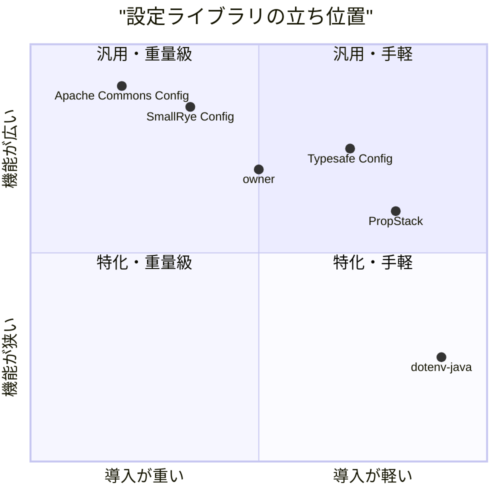
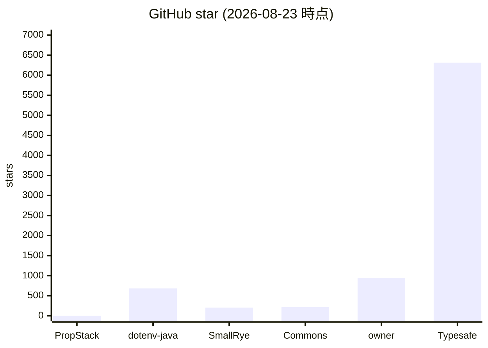
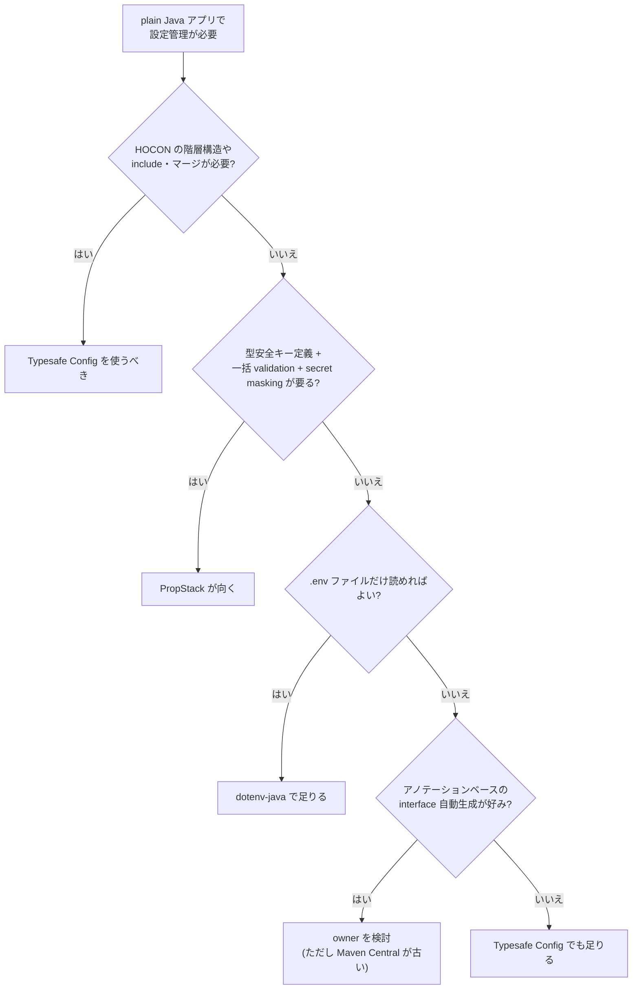

# PropStack 市場調査

## 0. 要約

PropStack は plain Java 向けのゼロ依存設定リゾルバ + コンポーネントレジストリで、型安全キー定義・一括 validation・secret マスク・`trace()` の 4 点で差別化を狙う。最大の弱点は、デファクトスタンダードの Typesafe Config と比較して「ゼロ依存」以外の決定的優位が薄く、Maven Central の最新版が 0.9.1（2026-04 公開）で 1.0.0 がまだ未公開であること。次の一手は、1.0.0 の Maven Central 公開と、Typesafe Config に無い `forUser()` / `trace()` / `validate()` / `dump()` の組合せを README の先頭に置くことである。

## 1. このrepoは何か

PropStack は **plain Java アプリ・ライブラリ向けの設定リゾルバ** である。DI フレームワーク（Spring / Quarkus / Guice / Dagger / Micronaut）を使わないプロジェクトが、型安全にプロパティを読み込み、一括で validation し、シークレットをマスクしたダンプを出し、値の出所を `trace()` で追跡するためのライブラリである。

**組み合わせで価値が出るか:** 基本的には単体で完結するライブラリである。前段・後段に LLM や別ツールは不要。ただし README が「DI フレームワークを使わないプロジェクト」という前提で書かれており、この前提（plain Java で設定管理を完結させたい）が PropStack の存在意義そのものである。

**提供価値:** 設定キーの型安全な定義（`TypedKey<T>` enum pattern）と、複数ソースのスタック解決（first-match-wins）、一括 validation、secret masking、source tracing を、依存ゼロ・アノテーションゼロ・プロキシゼロで提供する。

**想定利用者:** Spring Boot / Quarkus を使わない plain Java アプリケーション・ライブラリの開発者。README が明示的に「すでに Spring や Quarkus を使っているなら、そこに留めよ」と書いている通り、DI フレームワーク利用者は想定していない。

**到達点の客観指標:**
- ソースコード: 11 ファイル、1,181 LOC（src/main）
- テスト: 12 ファイル、152 `@Test`、1,574 LOC（src/test）
- 依存: ゼロ（pom.xml の dependencies は JUnit 5 のみ test scope）
- Maven Central: `org.unlaxer:propstack`、最新 0.9.1（2026-04-05 公開）。1.0.0 は GitHub でタグ付け済みだが Maven Central には未公開
- GitHub: stars 0、forks 0（参照日 2026-08-23、API 確認）。open issues 8
- 最終コミット: 2026-08-06（docs 修正）
- ライセンス: MIT
- 公開 URL: https://github.com/opaopa6969/propstack

## 1.5 調査の型

**`target_type: library`** — コードが読めるので、機能の有無だけでなく実装の質と重さを比較できる。比較の主軸は **機能 + 実装（API 面・依存の重さ・テスト量・配布サイズ・ライセンス制約）** である。

PropStack は `Registry`（コンポーネントレジストリ）という第二の顔を持つが、README と CHANGELOG が明示的に「Registry は optional companion、PropStack が存在理由」と位置づけているため、本調査の主軸は PropStack（設定リゾルバ）に置く。Registry は 4 節で別行として扱う。

## 2. 比較対象と選定理由

| 製品 | 何ができるか | 採用状況 | ライセンス | うちとの決定的な違い | なぜ選んだか |
|---|---|---|---|---|---|
| **Typesafe Config** (lightbend/config) | HOCON/JSON/properties の多ソーススタック解決。不変 `Config` インスタンス。変数置換・include・マージ | ★6,314 / 最終コミット 2026-07-01 / "feature complete" 宣言済み | Apache-2.0 | ゼロ依存だが型安全キー定義が無い（`getString("key")` で String 型）。`validate()` / `dump()` / `trace()` 無し。`forUser()` 無し | plain Java 設定ライブラリの事実上の標準。star 数が桁違いで比較の基準点になる |
| **owner** (lviggiano/owner) | アノテーションベースの型安全設定。Java インターフェースから実装を自動生成。`.properties`/XML/`.env`/INI 対応。ホットリロード | ★940 / 最終コミット 2026-08-22 / Maven Central 最新は 1.0.12 (2020-06) | BSD-3-Clause | ゼロ依存だがアノテーション + リフレクション/proxy に依存。Maven Central が 5 年未更新。PropStack はアノテーション不要・proxy 不要 | アノテーションベースの型安全設定の代表格。PropStack の enum pattern と直接比較できる |
| **dotenv-java** (cdimascio/dotenv-java) | `.env` ファイルから環境変数を読む。Ruby dotenv の pure Java ポート。`dotenv.get("KEY")` で `System.getenv()` の代わり | ★684 / 最終コミット 2026-03-15 | Apache-2.0 | ゼロ依存だが `.env` 読み込みのみ。型変換・スタック・validation 無し。PropStack の `fromClasspath` / `fromPath` で同じことができる | README が「dotenv-java + enum より何が増えるか」を比較表に使っている。最小限のベースラインとして選んだ |
| **SmallRye Config** (smallrye/smallrye-config) | MicroProfile Config 実装。`@ConfigMapping` 型安全バインディング。YAML/properties/env 多ソース。CDI あり・なし両モジュール | ★206 / 最終コミット 2026-08-21 / 非常に活発 | Apache-2.0 | standalone 利用可能だが依存多数（microprofile-config-api, jboss-logging, ASM 等）。PropStack はゼロ依存 | README が SmallRye Config を「genuinely comparable」として比較表に含めている。Quarkus エコシステム外での選択肢として |
| **Apache Commons Configuration** (apache/commons-configuration) | 重量級・多機能。properties/XML/JSON/YAML/ini/plist/JDBC/JNDI 多ソース。階層型設定、動的リロード、Bean Validation 連携 | ★215 / 最終コミット 2026-08-18 | Apache-2.0 | 必須依存 4 件（commons-lang3, commons-text, commons-logging, commons-io）。PropStack はゼロ依存 | 「plain Java で設定」という領域の重量級端。PropStack が軽量であることの対比として選んだ |

**どういう地図なのか:** plain Java の設定ライブラリは、Typesafe Config がデファクトスタンダードとして寡占している。Typesafe Config は「feature complete」を宣言しており、機能追加はほぼ無いが、Akka / Play Framework で標準採用されているため、エコシステムの重力が強い。owner は型安全設定の先駆けだが Maven Central 公開が 5 年止まっており、実質的に「古いがまだ動く」状態。dotenv-java は .env 特化で軽量だが、設定管理の全体をカバーするものではない。SmallRye Config は機能豊富だが依存が重く、plain Java の「軽量」要件とは tension がある。Apache Commons Configuration は多機能だが必須依存 4 件で、PropStack とは逆方向（重量級）に位置する。

この地図で PropStack は「Typesafe Config と同じゼロ依存の立ち位置で、型安全キー定義 + validation + secret masking + trace + forUser を足したもの」という位置を狙う。ゼロ依存の立ち位置には Typesafe Config が既にいるため、PropStack の差別化は「Typesafe Config に何が足りないか」で測られる。

## 3. ポジショニング

x軸は「導入の重さ」= 依存数と設定の複雑さ。y軸は「機能の広さ」= ソース種別・変換・validation・trace の覆盖度。PropStack はゼロ依存で導入が軽く、型安全・validation・trace・forUser がある程度機能も持つ。Typesafe Config は同じくゼロ依存で機能が広い（HOCON・include・マージ）。dotenv-java は最も軽いが .env のみで狭い。Commons / SmallRye は機能広いが依存が重い。

## 4. 機能比較

| 機能 | 重み | PropStack | Typesafe Config | owner | dotenv-java | SmallRye Config | Commons Config |
|---|---|---|---|---|---|---|---|
| ゼロ依存 | ◎必須 | ○ | ○ | ○ | ○ | ×(多数) | ×(必須4+) |
| 型安全キー定義 | ◎必須 | ○ `TypedKey<T>` enum | ×`getString()` | ○`@DefaultValue`+interface | ×`String` | ○`@ConfigMapping` | △`getString()` |
| 一括 validation | ○効く | ○`validate()` | × | △`@DefaultValue`で回避 | × | ○ | △ |
| Secret masking | ○効く | ○`.secret()`/`dump()` | × | △暗号化で対応 | × | × | × |
| Source tracing | ○効く | ○`trace()` | × | △`Traceable` iface | × | △ | × |
| per-developer override | △あれば | ○`forUser()` | × | × | × | × | × |
| per-host override | △あれば | ○`forHost()` | × | × | × | × | × |
| 変数展開 `${VAR}` | ○効く | ○ | ○ | ○ | × | ○ | ○ |
| 複数ファイル形式 | △あれば | △properties only | ○HOCON/JSON/props | ○props/XML/.env/INI | △.env only | ○YAML/props | ○props/XML/JSON/YAML/ini |
| ファイル include / マージ | △あれば | × | ○ | × | × | ○ | ○ |
| ホットリロード | △あれば | × | × | ○ | × | △ | ○ |
| CLI args `--KEY=value` | △あれば | ○`fromArgs()` | × | × | × | △ | △ |
| Registry (component map) | —(別物) | ○`Registry` | × | × | × | × | × |
| Maven Central 公開 | ◎必須 | △(0.9.1まで) | ○(1.4.9) | △(1.0.12, 2020年) | ○(3.2.0) | ○(3.18.2) | ○(2.15.1) |

凡例: ○=ある / △=部分的・要設定 / ×=無い ／ 重み: ◎=この立ち位置で必須 / ○=効く / △=あれば良い / —=不要

**×のうち痛いもの:** ファイル include / マージ と ホットリロード は、Typesafe Config / owner / Commons にあるが PropStack に無い。ただし PropStack の立ち位置（plain Java、起動時に全て読む、first-match-wins）では、include は `defaultSources()` で手動スタック構築で代替でき、ホットリロードは「DI フレームワークを使わない」プロジェクトのユースケースでは需要が低いと読める。痛い × は Maven Central の 1.0.0 未公開のみ。README が 1.0.0 を前提に書かれているのに Maven Central に無いのは、新規導入者の信頼を削ぐ。

**○のうち実は差別化になっていないもの:** 変数展開は Typesafe Config / owner / SmallRye / Commons も持つため差別化にならない。CLI args は便利だが `.env` と env var で代替可能で、選択を左右するものではない。Registry は README が「optional companion、存在理由ではない」と明記している通り、設定リゾルバとしての比較では考慮しない。

**本当の差別化は 4 点:** `validate()`（一括）、`trace()`（出所追跡）、`.secret()`（マスク）、`forUser()`（per-developer）。この 4 点が揃っているライブラリは、調査範囲では他に無かった。

## 4.5 コード・実装の比較

| 観点 | PropStack | Typesafe Config | owner | dotenv-java | 出典 |
|---|---|---|---|---|---|
| 公開API数(概算) | ~75 (33 PropStack + 12 PropertySource + 19 Registry + 11 TypedKey) | ~60 (`Config` + `ConfigFactory`) | ~30 (`Config` interface) | ~10 (`Dotenv`) | 各 src の public method をカウント |
| 依存パッケージ数 | 0 | 0 | 0 | 0 | 各 pom.xml の dependencies (test scope 除く) |
| テスト数 | 152 `@Test` | (確認せず) | (確認せず) | (確認せず) | `grep -c '@Test'` 実行 |
| テスト LOC | 1,574 | (確認せず) | (確認せず) | (確認せず) | `wc -l` 実行 |
| メイン LOC | 1,181 | ~6,000+(推測) | ~3,000+(推測) | ~300(推測) | `wc -l` 実行 / うちのみ実測 |
| ライセンスの制約 | MIT | Apache-2.0 | BSD-3-Clause | Apache-2.0 | 各 LICENSE / pom.xml |
| Java バージョン | 21+ | 8+ | 8+ | 11+ | 各 pom.xml / README |

**実装方針の違い:** PropStack は `List<PropertySource>` を `ArrayList` で持ち、first-match-wins を for-loop で走査する。シンプルで読めるが、スレッドセーフ性は `sources` リスト自体に依存する（`ConcurrentHashMap` は Registry のみ）。Typesafe Config は不変 `Config` インスタンスでスレッドセーフ性を保証する。owner はアノテーション + リフレクション/proxy で interface 実装を動的生成する。PropStack はアノテーションも proxy も使わないが、代わりに enum pattern で型安全性を実現する。

PropStack の `convert()` は `if (type == Integer.class)` の連鎖で、`Map<Class, Function>` のテーブル化ができるが、現状の実装で十分読める。`VariableExpander` は循環参照検出を持たない（architecture.md に明記）。

## 5. 採用状況

PropStack の star は 0 である（参照日 2026-08-23、GitHub API 確認）。これは新規公開リポジトリ（2026-04-04 作成）で、まだ外部に知られていないことを示す。Typesafe Config は 6,314 star で、この領域のデファクトスタンダードとしての重力を示す。owner は 940 star で、型安全設定の先駆けとして認知されているが Maven Central 未更新が懸念。dotenv-java は 684 star で、.env 特化のニッチだが安定した需要がある。

## 5.5 調査者の見立て

**何が本当の勝負所か:** 機能比較表では PropStack に ○ が並ぶが、実際の選択を左右するのは「Typesafe Config で足りるか」の一点に集約されると読める。Typesafe Config はゼロ依存で 6,314 star のデファクトであり、HOCON・include・マージを持つ。PropStack が足すのは `validate()` / `trace()` / `.secret()` / `forUser()` だが、これらは「あれば便利」で「無いと困る」かと言うと、Typesafe Config ユーザーは 6,314 人いて困っていない。PropStack の勝負所は、これら 4 機能が「plain Java で DI 無しで設定を管理する」ユースケースで、Typesafe Config では填まらない具体的な痛みを解決しているかどうかである。

**数字に出ていないが気になること:** Maven Central の最新版が 0.9.1（2026-04-05 公開）で、1.0.0 が GitHub ではタグ付け済み（CHANGELOG に 1.0.0 エントリあり）なのに Maven Central に無い。これは新規導入者が「1.0.0 を使おう」と思った時に `pom.xml` に書いたバージョンが解決せず、離脱する原因になる。GitHub の pom.xml は `<revision>1.0.0</revision>` だが Maven Central の latest は 0.9.1 である。この乖離は、star 0 と相まって「まだ準備中のライブラリ」という印象を与える。また、owner の Maven Central が 5 年未更新である問題は、PropStack にとっても「小規模・個人運営の設定ライブラリは長続きしない」という先例リスクとして認識される可能性がある。

**自分ならどうするか:** PropStack の立場なら、最初にやるべきは 1.0.0 の Maven Central 公開である。次に、README の先頭を「Typesafe Config で困っていること」から始める。現在の README は「The Problem Nobody Solved」で per-developer override を訴求しているが、これは `forUser()` という単一機能の訴求で、Typesafe Config ユーザーが乗り換える動機としては弱い（`.env` で十分な人が多い）。`validate()` / `trace()` / `.secret()` / `dump()` の組合せが「設定の運用性」を変えることを先頭に置く。Registry は README から分離する。Registry は設定リゾルバの価値を薄める（「何のライブラリか分からない」になる）。

**この見立てが外れるとしたらどこか:** Typesafe Config が `validate()` / `trace()` / secret masking を後継（feature complete だが fork が出る可能性）で追加した場合、PropStack の差別化は `forUser()` のみになる。`forUser()` は便利だが `.env` + gitignore で代替可能であり、単独では乗り換え動機として弱い。また、SmallRye Config が standalone 利用時の依存を削減した場合、PropStack の「ゼロ依存」の優位が SmallRye に対して薄まる。逆に、もし plain Java の設定管理が「HOCON は過剰、.env は足りない、型安全 + validation が要る」という中間層の需要を捉えた場合、PropStack はその中間の最適解になりうる。この見立ての成否は、1.0.0 公開後 3 ヶ月の Maven Central ダウンロード数と GitHub star の推移で判定できる。

## 6. 提案

| 順 | 提案 | 分類 | 根拠 | 最小の一手 | 効きそうな指標 |
|---|---|---|---|---|---|
| 1 | **1.0.0 を Maven Central に公開する** | 埋める | README が 1.0.0 前提で pom.xml も 1.0.0 だが Maven Central が 0.9.1。新規導入者が最初にぶつかる壁 / CHANGELOG に 1.0.0 エントリあり | `mvn deploy -P release` を実行し Maven Central に 1.0.0 を staging → release | Maven Central 1.0.0 のダウンロード数 |
| 2 | **README の先頭を「Typesafe Config で困ること」にする** | 伸ばす | 現在の先頭は「The Problem Nobody Solved」(per-developer override)だが、これは `forUser()` 単機能の訴求で弱い。`validate()` / `trace()` / `.secret()` / `dump()` の組合せが Typesafe Config に無い運用性の差 / 4節比較表 | README の比較表を先頭に移動し、Typesafe Config を基準に「これらが無いとどう困るか」を書く | GitHub star / clone 数 |
| 3 | **Registry を README から分離または別ページにする** | 伸ばす | README が「2つのもの（PropStack + Registry）」と明記しながら両方を同じページに書いており、「何のライブラリか」がぼやける。Registry は optional companion と明記済み / README L83-95 | Registry 節を `docs/registry.md` に移動し、README に1行リンクだけ残す | README の直帰率 / 「設定ライブラリ」としての認知の一貫性 |
| 4 | **`trace()` に「全ソース表示」オプションを追加する** | 埋める | 現在 `trace()` は first-match で停止する。全レイヤーを同時に見たいケース（「どこに何が書いてあるか」の監査）があり、architecture.md の Remaining Tasks にも挙がっている / architecture.md L196 | `trace(key, boolean showAll)` または `traceAll(key)` を追加 | 機能比較表の trace 行を ○→◎ に引き上げる材料 |
| 5 | **Javadoc サイトを GitHub Pages に公開する** | 埋める | architecture.md の Remaining Tasks に挙がっている。Maven Central から飛べる Javadoc は、Java ライブラリの信頼性に直結する / architecture.md L194 | `mvn javadoc:jar` + GitHub Pages アクションを CI に追加 | Javadoc ページの PV / Maven Central からのリンククリック |
| 6 | **HOCON / YAML 対応はやらない** | やらない | Typesafe Config が HOCON で勝っている領域に乗り込むのは、差別化を薄める。PropStack の価値は「ゼロ依存 + 型安全 + validation + trace」であって「設定ファイル形式の豊富さ」ではない。YAML パーサーを依存に加えると「ゼロ依存」が消える | — | — |
| 7 | **ホットリロードはやらない** | やらない | owner / Commons が持つが、PropStack の立ち位置（plain Java、起動時に全て読む）では需要が低い。実装コスト（ファイル watch + スレッド）が「ゼロ依存・シンプル」の価値を削ぐ | — | — |

## 7. 選択の分岐

PropStack を選ぶべきでない条件: HOCON の階層構造が必要な場合（Typesafe Config が適している）、ホットリロードが必要な場合（owner / Commons が適している）、Kotlin プロジェクトの場合（Hoplite が適している）、Spring Boot / Quarkus を使っている場合（内蔵の設定管理を使うべき）。

## 8. 出典

| URL | 参照日 | 何の根拠に使ったか |
|---|---|---|
| https://github.com/opaopa6969/propstack | 2026-08-23 | 自 repo の内容確認。README, src/main, src/test, pom.xml, CHANGELOG.md を実際に読んだ |
| https://api.github.com/repos/opaopa6969/propstack | 2026-08-23 | star 数(0), forks(0), open issues(8), 作成日(2026-04-04), 最終 push(2026-08-06) |
| https://repo1.maven.org/maven2/org/unlaxer/propstack/maven-metadata.xml | 2026-08-23 | Maven Central 公開版の確認。latest=0.9.1, lastUpdated=2026-04-05。1.0.0 は未公開 |
| https://github.com/lightbend/config | 2026-08-23 | Typesafe Config の star(6,314), 最終コミット(2026-07-01), ライセンス(Apache-2.0), ゼロ依存, "feature complete" 宣言 |
| https://github.com/lviggiano/owner | 2026-08-23 | owner の star(940), 最終コミット(2026-08-22), ライセンス(BSD-3-Clause), ゼロ依存, Maven Central 1.0.12(2020-06) |
| https://github.com/cdimascio/dotenv-java | 2026-08-23 | dotenv-java の star(684), 最終コミット(2026-03-15), ライセンス(Apache-2.0), ゼロ依存 |
| https://github.com/smallrye/smallrye-config | 2026-08-23 | SmallRye Config の star(206), 最終コミット(2026-08-21), ライセンス(Apache-2.0), 依存多数, standalone 利用可能 |
| https://github.com/apache/commons-configuration | 2026-08-23 | Apache Commons Configuration の star(215), 最終コミット(2026-08-18), ライセンス(Apache-2.0), 必須依存4件 |
| src/main/java/org/unlaxer/propstack/*.java | 2026-08-23 | PropStack の全ソースコードを実際に読んだ。PropStack.java(429行), Registry.java(230行), PropertySource.java(256行), TypedKey.java(78行) 等。API 数・LOC・実装方針の確認 |
| src/test/java/org/unlaxer/propstack/*.java | 2026-08-23 | テストコードを実際に読んだ。152 @Test, 1574 LOC |
| docs/architecture.md | 2026-08-23 | architecture.md を読んだ。Remaining Tasks, trace() 動作, VariableExpander の循環参照未検出 |
| CHANGELOG.md | 2026-08-23 | CHANGELOG を読んだ。1.0.0(2026-05-14) の Registry instance-first 再設計, 0.9.x の機能追加履歴 |
| pom.xml | 2026-08-23 | 依存(JUnit5 test scope のみ), Java 21, revision=1.0.0, MIT ライセンス |
