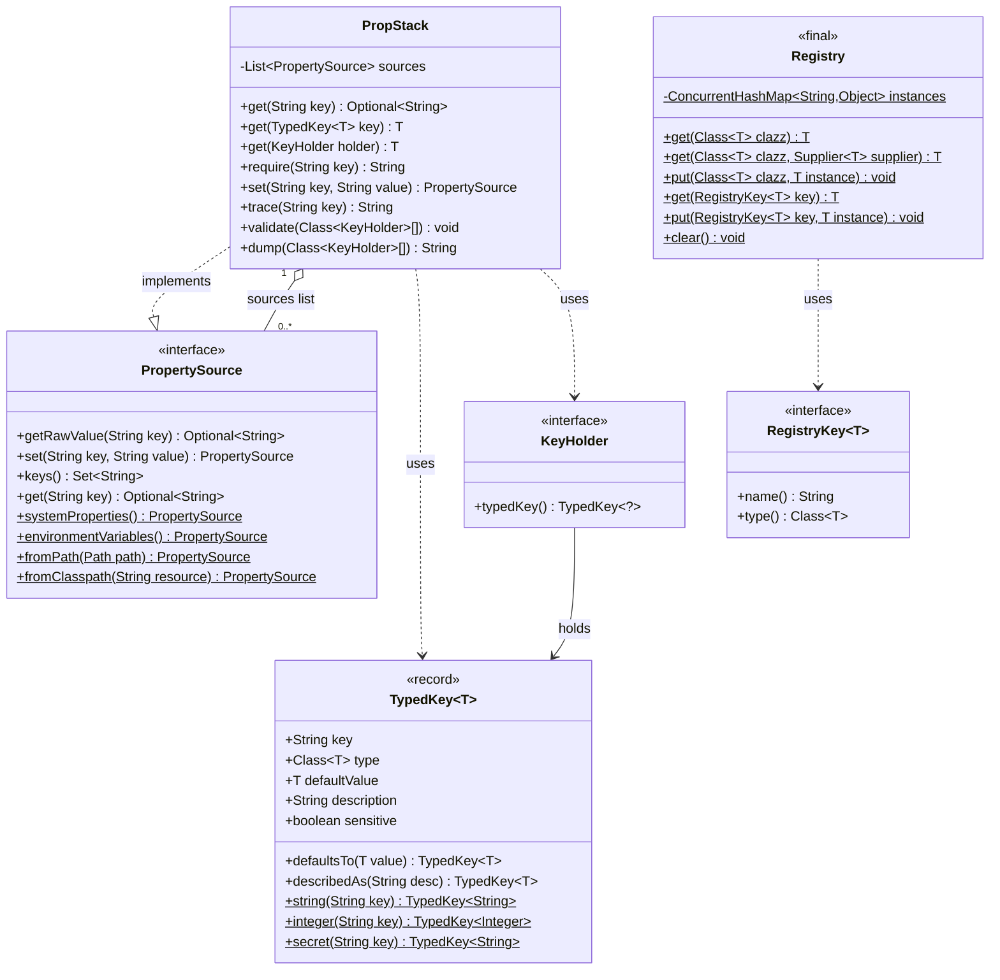

# PropStack — 仕様書 (SPEC.md)

**バージョン**: 0.9.2  
**ライブラリ**: `org.unlaxer:propstack`  
**リポジトリ**: https://github.com/opaopa6969/propstack  
**ライセンス**: MIT  
**最終更新**: 2026-04-19

---

## 目次

1. [概要](#1-概要)
2. [機能仕様](#2-機能仕様)
3. [データ永続化層](#3-データ永続化層)
4. [ステートマシン](#4-ステートマシン)
5. [ビジネスロジック](#5-ビジネスロジック)
6. [図 (Diagrams)](#6-図-diagrams)
7. [API / 外部境界](#7-api--外部境界)
8. [UI](#8-ui)
9. [設定](#9-設定)
10. [依存](#10-依存)
11. [非機能要件](#11-非機能要件)
12. [テスト戦略](#12-テスト戦略)
13. [デプロイ / 運用](#13-デプロイ--運用)

---

## 1. 概要

### 1.1 ライブラリの目的

PropStack は Java 21 以上で動作する **ゼロ依存のプロパティスタックライブラリ**である。  
主な責務は二つある。

| モジュール | 責務 |
|-----------|------|
| `PropStack` | 複数プロパティソースを順序付きリストに積み上げ、最初にマッチしたソースの値を返すカスケーディング解決 |
| `Registry` | アプリケーションスコープのコンポーネントを名前と型で管理するサービスロケーター |

これらは独立している。`PropStack` は文字列（プロパティ値）を読む。`Registry` はオブジェクト（コンポーネント）を管理する。アプリケーションコードがこの二つを組み合わせて配線する。

### 1.2 設計思想

- **ゼロ依存** — 本体コードに外部ライブラリを一切使用しない
- **ゼロアノテーション** — リフレクションマジック・プロキシなし
- **first-match-wins** — ソースリストを先頭から走査し、最初に値が見つかったところで終了する
- **コードとしてのドキュメント** — `TypedKey.describedAs()` で設計意図をコード上に残す
- **起動コスト ≒ 0** — `new PropStack()` は 1 行で完結し、フレームワーク初期化を必要としない

### 1.3 スコープ外

- Spring Boot / MicroProfile / Quarkus との統合機能
- YAML / TOML / HCL フォーマットの直接サポート
- 設定変更の動的リロード（watch/refresh）
- 暗号化された値の自動復号
- クラウドシークレットマネージャー（AWS Secrets Manager, Vault 等）のビルトイン対応

### 1.4 バージョン履歴サマリー

| バージョン | 変更概要 |
|-----------|---------|
| 0.9.2 (現在) | `PropStack`、`TypedKey`、`Registry`、`RegistryKey`、`KeyHolder` 安定化。`ApplicationProperties`・`Singletons` を後方互換エイリアスとして保持。 |
| 0.9.1 | Maven Central 初期パブリッシュ |

---

## 2. 機能仕様

### 2.1 PropStack — プロパティ解決

#### 2.1.1 コンストラクタ一覧

```java
// (A) ホームディレクトリなし: set() → -D → env → classpath
new PropStack()

// (B) アプリ名あり: set() → -D → env → ~/.<appName>/application.properties → classpath
new PropStack(String appName)

// (C) コマンドライン引数あり: args → set() → -D → env → home → classpath
new PropStack(String appName, String[] args)

// (D) フルカスタム: set() → (envあり: -D → env) → extras...
new PropStack(boolean enableEnvironments, PropertySource... extras)
```

コンストラクタ (A) は最小構成であり、本番環境ではほぼ全ての標準ソースを使う。(B) はユーザーホームディレクトリに機密情報を置くことを想定する。(D) はテストや特殊な構成に用いる。

#### 2.1.2 基本取得メソッド

| メソッド | 戻り型 | 未発見時の挙動 |
|---------|--------|--------------|
| `get(String key)` | `Optional<String>` | `Optional.empty()` |
| `get(String key, String defaultValue)` | `String` | `defaultValue` を返す |
| `getInt(String key, int defaultValue)` | `int` | `defaultValue` を返す |
| `getLong(String key, long defaultValue)` | `long` | `defaultValue` を返す |
| `getDouble(String key, double defaultValue)` | `double` | `defaultValue` を返す |
| `getBoolean(String key, boolean defaultValue)` | `boolean` | `defaultValue` を返す |
| `require(String key)` | `String` | `IllegalStateException` をスロー |

空白文字列（blank）のみの値は「未発見」として扱われ、`defaultValue` が採用される。これは `filter(s -> !s.isBlank())` による明示的なフィルタリングによる。

#### 2.1.3 `PropertyKey` 経由の取得

```java
enum MyKeys implements PropertyKey {
    DB_HOST;
    public String key() { return name(); }
}

String host = props.get(MyKeys.DB_HOST, "localhost");
props.require(MyKeys.DB_HOST);
```

`PropertyKey` は文字列キーにコンパイル時安全性を付与するだけのインタフェースである。型変換は行わない。

#### 2.1.4 `TypedKey<T>` 経由の取得

```java
TypedKey<Integer> port = TypedKey.integer("PORT").defaultsTo(8080);
int p = props.get(port);   // 型安全、デフォルト値付き

TypedKey<Long> timeout = TypedKey.longKey("TIMEOUT_MS").defaultsTo(5000L);
long t = props.get(timeout);
```

`props.get(TypedKey<T>)` は内部で `convert(String, Class<T>)` を呼び、文字列から型変換を行う。サポート型は [5.3 型変換](#53-型変換) を参照。

#### 2.1.5 `KeyHolder` 経由の取得

```java
enum Smtp implements KeyHolder {
    HOST(TypedKey.string("SMTP_HOST").describedAs("SMTPサーバーホスト名")),
    PORT(TypedKey.integer("SMTP_PORT").defaultsTo(587)),
    PASSWORD(TypedKey.secret("SMTP_PASSWORD"));

    private final TypedKey<?> key;
    Smtp(TypedKey<?> key) { this.key = key; }
    public TypedKey<?> typedKey() { return key; }
}

String host = props.require(Smtp.HOST);   // HOST は required
int port    = props.get(Smtp.PORT);       // 587 (default)
```

`props.get(KeyHolder)` は内部で `props.get(holder.typedKey())` に委譲する。戻り型は `<T>` のキャストを用いた型推論による。

#### 2.1.6 プログラマティック設定

```java
props.set("KEY", "value");
```

`set()` は最高優先度の内部 `first` ソース（in-memory `HashMap`）に書き込む。テスト・ランタイムオーバーライドに用いる。`PropStack` 自身が `PropertySource` を実装しているため、他の `PropStack` インスタンスをソースとして積むことも可能である。

#### 2.1.7 ソースの動的組み立て

```java
var sources = PropStack.defaultSources("myapp");
sources.add(2, vaultSource);  // env vars の後ろに追加
PropStack props = new PropStack(false, sources.toArray(PropertySource[]::new));
```

`defaultSources(appName)` は変更可能な `ArrayList<PropertySource>` を返す。インデックスを指定して任意の位置にソースを挿入できる。これはカスタムソース（Vault, AWS SSM 等）をスタックに組み込む公式パターンである (DD-006)。

---

### 2.2 trace() — ソース追跡

```java
String report = props.trace("DB_HOST");
// DB_HOST:
//   [0] set()               → (empty)
//   [1] SystemProperties    → (empty)
//   [2] EnvironmentVariables → prod-db  ← MATCH
```

`trace(String key)` はソースリストを先頭から走査し、各ソースの値（または `(empty)`）を出力する。最初にマッチしたソースで走査を終了し、`← MATCH` マーカーを付ける。

オーバーロード一覧:

| メソッド | 説明 |
|---------|------|
| `trace(String key)` | キー名で追跡 |
| `trace(PropertyKey key)` | PropertyKey で追跡 |
| `trace(KeyHolder holder)` | KeyHolder で追跡 |

**制約**: マッチ後のソースは表示されない。全ソースを確認したい場合は `PropStack.defaultSources()` を手動でイテレートする必要がある（1.0 で `traceAll` 拡張を検討中）。

---

### 2.3 traceAll() — 複数キーの一括追跡

```java
List<String> reports = props.traceAll("DB_HOST", "DB_PORT", "JWT_SECRET");
reports.forEach(System.out::print);

// KeyHolder enum で一括
props.traceAll(Smtp.class, Db.class).forEach(System.out::print);
```

`traceAll` は `trace()` のラッパーであり、複数キーの追跡結果を `List<String>` で返す。入力と同じ順序が保証される。

---

### 2.4 validate() — 一括バリデーション

```java
props.validate(Smtp.class, Db.class);
// → IllegalStateException: Missing required properties: [SMTP_HOST, SMTP_USER, DB_NAME]
```

`validate(Class<? extends KeyHolder>...)` は渡された `KeyHolder` 列挙型の全エントリを走査し、`defaultValue == null` かつ値が未発見のキーを集積する。ミスが複数あっても **一度にすべて報告** する。単一チェック失敗ごとにスローする方式（Spring の起動エラー等）との設計対比。

バリデーション通過条件:

| 条件 | validate() の挙動 |
|------|-----------------|
| 値がどこかのソースに存在する | スキップ（OK） |
| `TypedKey.defaultsTo(v)` が設定済み | スキップ（OK） |
| 値なし + default なし | **MISSING として記録** |

---

### 2.5 dump() — 診断出力

```java
System.out.print(props.dump(Smtp.class, Db.class));
// --- Smtp ---
//   SMTP_HOST                  = smtp.gmail.com
//   SMTP_PORT                  = 587 (default)
//   SMTP_USER                  = user@example.com
//   SMTP_PASSWORD              = ****** (secret)
//   ALLOWED_ORIGINS            = [MISSING] — CORS allowed origins
// --- Db ---
//   DB_HOST                    = localhost (default)
//   DB_PORT                    = 5432 (default)
//   DB_NAME                    = [MISSING]
```

`dump()` は文字列を返す（`System.out` への自動出力は行わない）。呼び出し側が `print` するかログに渡す。

表示フォーマット規則:

| 状態 | 表示 |
|------|------|
| 値あり (sensitive=false) | 生の値 |
| 値あり (sensitive=true) | `******` |
| 値なし + `defaultsTo(v)` あり | `<defaultValue> (default)` |
| 値なし + default なし + `describedAs` あり | `[MISSING] — <description>` |
| 値なし + default なし | `[MISSING]` |

フォーマット文字列: `"  %-25s = %s%n"` — キー名は 25 文字左揃えで統一。

---

### 2.6 toProperties() — Properties エクスポート

```java
Properties p = props.toProperties();
```

全ソースの全キーをマージした `java.util.Properties` を返す。優先度順（後ろのソースから先に書き込み、前のソースが上書き）でビルドするため、最終的に解決される値が `Properties` に格納される。

---

### 2.7 keys() — 全キー取得

```java
Set<String> allKeys = props.keys();
```

全ソースの `keys()` の和集合を返す。重複は除去される。

---

## 3. データ永続化層

**N/A — PropStack はインメモリのみ。永続化ストアを持たない。**

### 3.1 インメモリデータ構造

#### 3.1.1 PropStack 内部ソースリスト

```
PropStack
  └── List<PropertySource> sources       (ArrayList)
        ├── sources[0]  HashMap<String,String>   ← first (set() 書き込み先)
        ├── sources[1]  System.getProperty()     ← SystemProperties
        ├── sources[2]  System.getenv()          ← EnvironmentVariables
        ├── sources[3]  Path → Properties        ← fromPath (ユーザーホーム)
        └── sources[n]  ClassLoader → Properties ← fromClasspath
```

- `first` ソースは `HashMap` バックの無名クラス。スレッド安全性は **保証されない**（`set()` は外部で同期が必要）。
- `fromPath` / `fromClasspath` は起動時に一度だけファイルを読み込み、結果を `Properties` オブジェクトとしてメモリに保持する。ファイルシステムの変更は自動では反映されない。

#### 3.1.2 Registry 内部マップ

```
Registry
  └── ConcurrentHashMap<String, Object> instances   (static, JVM ライフタイム)
        ├── "com.example.DataSource"           → DataSource インスタンス
        ├── "com.example.DataSource#PROD"      → DataSource インスタンス (named)
        └── "myCustomService"                  → Object
```

`ConcurrentHashMap` はクラス変数（`static`）であるため、`Registry.clear()` を呼ばない限りアプリケーション終了まで保持される。

### 3.2 外部ストレージとの関係

`PropertySource.fromPath(Path)` および `PropertySource.fromClasspath(String)` はファイルシステムや JAR クラスパス上のデータを読み取るが、これらは **起動時の一度読み限り**である。書き込みは行わない。環境変数・システムプロパティは OS プロセスが管理するものを参照する。

---

## 4. ステートマシン

**N/A — PropStack に状態遷移モデルは存在しない。**

PropStack の各メソッド呼び出しは副作用のない問い合わせ（`get`, `trace`, `validate`, `dump`）か、単純な書き込み（`set`）である。状態遷移を伴うライフサイクルは存在しない。

Registry についても同様。`put` → `get` → `remove` → `clear` の操作は独立したマップ操作であり、ライフサイクルステートを持たない。

---

## 5. ビジネスロジック

### 5.1 first-match-wins — カスケーディング解決

PropStack の中核ロジックは `PropStack.getRawValue(String key)` に実装される。

```java
@Override
public Optional<String> getRawValue(String key) {
    for (PropertySource source : sources) {
        Optional<String> value = source.get(key);
        if (value.isPresent()) return value;
    }
    return Optional.empty();
}
```

ソースリストをインデックス 0 から順に走査し、最初に `isPresent()` が `true` になった値を返す。残りのソースは参照されない。

これにより以下の優先度が実現される（高 → 低）:

```
1. props.set("KEY", "value")                 ← プログラマティックオーバーライド (最高)
2. -DKEY=value                               ← JVM システムプロパティ
3. KEY=value (環境変数)                      ← OS 環境変数
4. ~/.<appName>/application.properties      ← ユーザーホームファイル (appName 指定時)
5. classpath:application.properties         ← クラスパスデフォルト (最低)
```

### 5.2 TypedKey — 型安全キー

`TypedKey<T>` は Java `record` であり、以下のフィールドを持つ:

| フィールド | 型 | 説明 |
|-----------|-----|------|
| `key` | `String` | プロパティキー名（環境変数名・システムプロパティ名） |
| `type` | `Class<T>` | 期待する型 |
| `defaultValue` | `T` | デフォルト値。`null` = required |
| `description` | `String` | 説明文。`null` = 未設定。`dump()` で表示される |
| `sensitive` | `boolean` | `true` のとき `dump()` でマスクされる |

`record` であるため、構造的等価性（`equals` / `hashCode`）が自動実装される。`.defaultsTo()` と `.describedAs()` は **新しい `TypedKey` インスタンスを返す** イミュータブルビルダーパターンである。

### 5.3 型変換

`PropStack.convert(String value, Class<?> type)` が文字列から指定型への変換を担う:

| 型 | 変換ロジック |
|----|------------|
| `String` | そのまま返す |
| `Integer` / `int` | `Integer.parseInt(value)` |
| `Boolean` / `boolean` | `Boolean.parseBoolean(value)` |
| `Long` / `long` | `Long.parseLong(value)` |
| `Double` / `double` | `Double.parseDouble(value)` |
| `List` | `value.split(",")` → trim → filter(non-empty) → `List.of()` |
| その他 | 変換せず `String` として返す |

`List<String>` は `Class<List<String>>` のキャストで実現されており、ジェネリクスの型消去による制限をコンパイル時抑制アノテーションで回避している。

### 5.4 defaultsTo() vs describedAs() の意味論的差異

これは DD-008 で明文化されたコアデザイン決定である。

```
defaultsTo(v)
  → TypedKey.defaultValue = v
  → validate() は「値あり」扱いでスキップ
  → dump() は "<v> (default)" と表示
  → 意味: "この値は本番環境で安全なデフォルトを持つ"

describedAs("text")
  → TypedKey.description = "text"
  → validate() は値がなければ MISSING として記録
  → dump() は "[MISSING] — text" と表示
  → 意味: "この値は必須。ドキュメントとしてコードに説明を埋め込む"
```

`describedAs()` は `defaultValue = null` の状態を変えない。ドキュメントをコードに埋め込むための純粋なメタデータである。

### 5.5 required vs optional — バリデーション判定ロジック

```java
if (tk.defaultValue() == null && get(tk.key()).isEmpty()) {
    missing.add(tk.key());
}
```

| `defaultValue` | 値の存在 | 結果 |
|----------------|---------|------|
| `null` | なし | **MISSING (required 扱い)** |
| `null` | あり | OK |
| `!= null` | なし | OK（default を使用） |
| `!= null` | あり | OK（ソースの値を使用） |

### 5.6 VariableExpander — `${VAR}` 展開

`PropertySource.get(String key)` のデフォルト実装は `getRawValue()` の結果に `valueEffectors()` のリストを適用する。デフォルトのエフェクターは `VariableExpander.INSTANCE` 一つ。

展開ロジック: 正規表現 `\$\{([^}]+)\}` にマッチする部分を、`System.getProperty(key)` → `System.getenv(key)` の順で探した値で置換する。いずれも見つからない場合はプレースホルダーを **そのまま残す**（展開失敗でも例外をスローしない）。

**循環参照は検出されない**。`A=${B}` かつ `B=${A}` のような設定はスタックオーバーフローを起こさないが（再帰しない）、未解決のまま残る。

### 5.7 Registry キー生成ロジック

```java
private static String keyName(RegistryKey<?> key) {
    return key.type().getName() + "#" + key.name();
}
```

- クラス登録: `"com.example.MyClass"` （FQCN）
- RegistryKey 登録: `"com.example.MyClass#ENUM_CONST_NAME"` （FQCN + `#` + 列挙定数名）
- 文字列登録: 渡した文字列をそのまま使用

同一型で複数インスタンスを管理したい場合は `RegistryKey<T>` enum を使う。クラス登録は「型あたり一つ」の制約を持つ。

### 5.8 lazy initialization — computeIfAbsent

```java
public static <T> T get(Class<T> clazz, Supplier<T> supplier) {
    return (T) instances.computeIfAbsent(clazz.getName(), k -> supplier.get());
}
```

`Supplier` を受け取る `get()` は `computeIfAbsent` を使用するため、スレッドセーフなレイジー初期化が実現される。`Supplier` が一度も呼ばれないパスも、複数スレッドから同時呼び出しされるパスも安全に扱われる。

---

## 6. 図 (Diagrams)

### 6.1 クラス図 — 主要型の関係



### 6.2 フローチャート — first-match-wins 解決

```mermaid
flowchart TD
    A([props.get&lpar;key&rpar;]) --> B[index = 0]
    B --> C{index < sources.size?}
    C -- No --> D([return Optional.empty])
    C -- Yes --> E[source = sources&#91;index&#93;]
    E --> F[value = source.getRawValue&lpar;key&rpar;]
    F --> G{value.isPresent\nAND not blank?}
    G -- Yes --> H[VariableExpander を適用]
    H --> I([return Optional.of&lpar;value&rpar;])
    G -- No --> J[index++]
    J --> C

    style A fill:#4a9eff,color:#fff
    style I fill:#2ecc71,color:#fff
    style D fill:#e74c3c,color:#fff
```



### 6.3 シーケンス図 — Registry.get(Class) auto-create

```mermaid
sequenceDiagram
    participant App as アプリケーション
    participant Reg as Registry
    participant Map as ConcurrentHashMap
    participant Sup as Supplier&lt;T&gt;

    App->>Reg: get(MyService.class, () -> new MyService())
    Reg->>Map: computeIfAbsent("com.example.MyService", supplier)
    alt キーが存在しない（初回）
        Map->>Sup: supplier.get()
        Sup-->>Map: new MyService()
        Map-->>Reg: MyService インスタンス（登録済み）
    else キーが既に存在する
        Map-->>Reg: 既存の MyService インスタンス
    end
    Reg-->>App: T (MyService)

    Note over App,Map: 2回目以降は Supplier を呼ばない
    App->>Reg: get(MyService.class, () -> new MyService())
    Reg->>Map: computeIfAbsent("com.example.MyService", supplier)
    Map-->>Reg: キャッシュ済みインスタンス
    Reg-->>App: T (MyService) — Supplier 未呼び出し
```

---

## 7. API / 外部境界

### 7.1 公開 API 一覧

以下のクラス / インタフェースが公開 API を構成する。

#### 7.1.1 `PropStack`

```java
public class PropStack implements PropertySource {

    // コンストラクタ
    public PropStack()
    public PropStack(String appName)
    public PropStack(String appName, String[] args)
    public PropStack(boolean enableEnvironments, PropertySource... extras)

    // ソース構築ヘルパー
    public static ArrayList<PropertySource> defaultSources(String appName)

    // 基本取得
    public Optional<String> get(String key)           // PropertySource から継承
    public String get(String key, String defaultValue)
    public int     getInt   (String key, int     defaultValue)
    public long    getLong  (String key, long    defaultValue)
    public double  getDouble(String key, double  defaultValue)
    public boolean getBoolean(String key, boolean defaultValue)
    public String  require(String key)

    // PropertyKey 経由
    public String  get    (PropertyKey key, String  defaultValue)
    public int     getInt (PropertyKey key, int     defaultValue)
    public int     getInt (PropertyKey key)               // default 0
    public long    getLong(PropertyKey key, long    defaultValue)
    public double  getDouble(PropertyKey key, double defaultValue)
    public boolean getBoolean(PropertyKey key, boolean defaultValue)
    public String  require(PropertyKey key)

    // TypedKey 経由
    public <T> T get    (TypedKey<T> key)
    public <T> T require(TypedKey<T> key)

    // KeyHolder 経由
    public <T> T get    (KeyHolder holder)
    public <T> T require(KeyHolder holder)

    // 診断・バリデーション
    public String       trace   (String key)
    public String       trace   (PropertyKey key)
    public String       trace   (KeyHolder holder)
    public List<String> traceAll(String... keys)
    public List<String> traceAll(Class<? extends KeyHolder>... keyHolderClasses)
    @SafeVarargs
    public final void   validate(Class<? extends KeyHolder>... keyHolderClasses)
    @SafeVarargs
    public final String dump    (Class<? extends KeyHolder>... keyHolderClasses)

    // PropertySource 実装
    @Override public Optional<String> getRawValue(String key)
    @Override public PropertySource   set(String key, String value)
    @Override public Set<String>      keys()
    @Override public Properties       toProperties()
}
```

#### 7.1.2 `TypedKey<T>`

```java
public record TypedKey<T>(
    String key, Class<T> type, T defaultValue, String description, boolean sensitive
) {
    // ファクトリメソッド
    public static TypedKey<String>        string    (String key)
    public static TypedKey<String>        secret    (String key)
    public static TypedKey<Integer>       integer   (String key)
    public static TypedKey<Boolean>       bool      (String key)
    public static TypedKey<Long>          longKey   (String key)
    public static TypedKey<Double>        doubleKey (String key)
    public static TypedKey<List<String>>  stringList(String key)

    // ビルダースタイル（新インスタンスを返す）
    public <V> TypedKey<V> defaultsTo (V value)
    public TypedKey<T>     describedAs(String desc)
}
```

#### 7.1.3 `PropertySource`

```java
public interface PropertySource {

    // 抽象メソッド（実装必須）
    Optional<String> getRawValue(String key)
    PropertySource   set(String key, String value)
    Set<String>      keys()

    // デフォルトメソッド
    default Optional<String>              get(String key)          // VariableExpander 適用済み
    default Optional<String>              get(String... keys)      // 複数キー、first-match
    default Optional<String>              get(PropertyKey key)
    default Optional<String>              get(PropertyKey... keys)
    default Properties                    toProperties()
    default List<UnaryOperator<String>>   valueEffectors()         // [VariableExpander.INSTANCE]
    default String                        name()

    // 組み込みファクトリ
    static PropertySource systemProperties()
    static PropertySource environmentVariables()
    static PropertySource fromPath(Path path)
    static PropertySource fromClasspath(String resource)
    static PropertySource fromArgs(String[] args)
    static PropertySource forProfile(String profile)
    static PropertySource forProfile(String appName, String profile)
    static PropertySource forHost()
    static PropertySource forUser()
    static PropertySource forOs()
    static PropertySource of(Map<String, String> map)
    static PropertySource of(Properties properties)
}
```

#### 7.1.4 `Registry`

```java
public final class Registry {

    // クラス指定
    public static <T> T    get    (Class<T> clazz)
    public static <T> T    get    (Class<T> clazz, Supplier<T> supplier)
    public static <T> void put    (Class<T> clazz, T instance)
    public static    void  remove (Class<?> clazz)
    public static    boolean contains(Class<?> clazz)

    // RegistryKey 指定
    public static <T> T    get    (RegistryKey<T> key)
    public static <T> T    get    (RegistryKey<T> key, Supplier<T> supplier)
    public static <T> void put    (RegistryKey<T> key, T instance)
    public static <T> void remove (RegistryKey<T> key)
    public static <T> boolean contains(RegistryKey<T> key)

    // 文字列名指定
    public static <T> T  get    (String name)
    public static <T> T  get    (String name, Supplier<T> supplier)
    public static    void put   (String name, Object instance)
    public static    void remove(String name)

    // 管理
    public static void clear()
    public static int  size()
}
```

#### 7.1.5 `KeyHolder`

```java
public interface KeyHolder {
    TypedKey<?> typedKey();
}
```

`KeyHolder` を実装する `enum` は、関連するプロパティキーをグループ化する。Java の enum ジェネリクス制限（`enum Smtp<T>` は書けない）を回避するため、型情報は `TypedKey<?>` に委譲する (DD-003)。

#### 7.1.6 `RegistryKey<T>`

```java
public interface RegistryKey<T> {
    String   name();   // enum の定数名がデフォルト
    Class<T> type();
}
```

#### 7.1.7 `PropertyKey`

```java
public interface PropertyKey {
    String key();
}
```

型変換なしのシンプルなキー列挙に使用する。`TypedKey` / `KeyHolder` より軽量。

### 7.2 後方互換 API

| 後方互換クラス | 委譲先 | 変更点 |
|-------------|--------|--------|
| `ApplicationProperties` | `PropStack` | デフォルト appName が `"volta"` |
| `Singletons` | `Registry` | クラス指定のみ対応（RegistryKey 非対応） |

`ApplicationProperties` と `Singletons` は既存コードの変更なしに継続利用できる。新規コードでは `PropStack` / `Registry` を使う。

### 7.3 Maven 座標

```xml
<dependency>
    <groupId>org.unlaxer</groupId>
    <artifactId>propstack</artifactId>
    <version>0.9.2</version>
</dependency>
```

---

## 8. UI

**N/A — PropStack はライブラリであり、UI を持たない。**

`dump()` と `trace()` が診断出力を文字列として返すが、これを表示する画面・端末は呼び出し側が制御する。PropStack 本体は `System.out` への書き込みを行わない（`fromPath()` のエラーは `System.err` に出力する例外あり）。

---

## 9. 設定

### 9.1 ソースの種類と優先度

```
優先度 高 ──────────────────────────────────── 低
  [0] props.set("KEY", "val")   プログラマティック
  [1] -DKEY=val                 JVM システムプロパティ
  [2] KEY=val                   OS 環境変数
  [3] ~/.<appName>/application.properties    ユーザーホームファイル
  [4] classpath:application.properties       クラスパスデフォルト
```

### 9.2 環境変数ソース

`PropertySource.environmentVariables()` は `System.getenv(key)` を参照する。OS の環境変数を直接参照するため、JVM プロセス起動前に設定されている必要がある。`set()` によるオーバーライドも受け付けるため、テスト時に実環境変数なしでのシミュレーションが可能。

標準的なユースケース:

```bash
export DB_HOST=prod-db.internal
export DB_PASSWORD=s3cret
java -jar myapp.jar
```

### 9.3 システムプロパティソース

`PropertySource.systemProperties()` は `System.getProperty(key)` を参照する。コマンドラインでの指定:

```bash
java -DDB_HOST=localhost -DPORT=9090 -jar myapp.jar
```

### 9.4 ファイルソース — ユーザーホーム

`new PropStack("myapp")` を使うと、`~/.<appName>/application.properties` が解決スタックに自動追加される。

```
~/.myapp/application.properties
```

ファイルが存在しない場合は **サイレントにスキップ** される（例外をスローしない）。存在するが読み取り失敗した場合は `System.err` に警告を出力する。

典型的な用途: 開発者ごとのローカル設定（DB パスワード、API キー）を git 管理外のホームディレクトリに置く。

### 9.5 ファイルソース — クラスパス

`PropertySource.fromClasspath("application.properties")` は `Thread.currentThread().getContextClassLoader()` を使い、クラスパス上のリソースを読む。ファイルが見つからない場合は空のソースとして扱われる。

典型的なディレクトリ構成:

```
src/main/resources/
  application.properties                         ← 共有デフォルト値
  application.user_alice.properties              ← Alice の開発環境オーバーライド
  application.user_bob.properties                ← Bob の開発環境オーバーライド
  application.host_prod-server-01.properties     ← 特定ホストの設定
  application.prod.properties                    ← prod プロファイル
```

### 9.6 コマンドライン引数ソース

`new PropStack(appName, args)` または `PropertySource.fromArgs(String[] args)` で、`--KEY=value` 形式のコマンドライン引数をソースとして追加できる。

```bash
java -jar app.jar --DB_HOST=prod-db --DB_PORT=3306
```

コンストラクタ (C) を使うと `args` ソースは `set()` の次（インデックス 1）に挿入され、システムプロパティより高い優先度を持つ。

### 9.7 プロファイルベースソース

```java
PropertySource.forProfile("prod")         // classpath: application.prod.properties
PropertySource.forProfile("myapp", "prod") // ~/myapp/application.prod.properties
PropertySource.forHost()                  // classpath: application.host_<hostname>.properties
PropertySource.forUser()                  // classpath: application.user_<username>.properties
PropertySource.forOs()                    // classpath: application.os_<osname>.properties
```

これらはすべて `fromPath()` または `fromClasspath()` のラッパーであり、ファイルが存在しない場合はサイレントにスキップされる。

ホスト名は `InetAddress.getLocalHost().getHostName()` で取得する。取得失敗時は空ソースが返る。ユーザー名は `System.getProperty("user.name")`。OS 名は `System.getProperty("os.name")` を小文字化・空白を `_` に置換したもの。

### 9.8 カスタムソースの実装

`PropertySource` インタフェースを実装することで、任意のバックエンドをスタックに組み込める:

```java
public class VaultSource implements PropertySource {
    @Override
    public Optional<String> getRawValue(String key) {
        return vaultClient.read(key);
    }
    @Override
    public PropertySource set(String key, String value) {
        throw new UnsupportedOperationException("Vault is read-only");
    }
    @Override
    public Set<String> keys() { return Set.of(); /* 列挙不可 */ }
    @Override
    public String name() { return "Vault"; }
}

var sources = PropStack.defaultSources("myapp");
sources.add(2, new VaultSource()); // env の後ろ、home の前
PropStack props = new PropStack(false, sources.toArray(PropertySource[]::new));
```

### 9.9 `${VAR}` 変数展開

プロパティ値内の `${VAR}` 形式のプレースホルダーは、`VariableExpander` によって自動展開される。展開ソースはシステムプロパティ → 環境変数の順。

```properties
# application.properties
DB_URL=jdbc:postgresql://${DB_HOST}:${DB_PORT}/${DB_NAME}
GREETING=hello ${USER}
```

展開をカスタマイズしたい場合は `PropertySource.valueEffectors()` をオーバーライドして独自の `UnaryOperator<String>` を追加する。

---

## 10. 依存

### 10.1 ランタイム依存

**ゼロ依存** — PropStack 本体は `java.*` / `java.nio.*` のみを使用する。外部ライブラリへの依存は一切ない。

```xml
<!-- pom.xml — ランタイム依存なし -->
<dependencies>
    <!-- テストスコープのみ -->
    <dependency>
        <groupId>org.junit.jupiter</groupId>
        <artifactId>junit-jupiter</artifactId>
        <version>5.12.2</version>
        <scope>test</scope>
    </dependency>
</dependencies>
```

### 10.2 Java バージョン要件

- **最低バージョン**: Java 21
- Java 21 固有機能の使用箇所:
  - `record` — `TypedKey<T>` が `record` で定義される
  - `instanceof` パターンマッチング（将来の拡張で利用可能）
  - `List.of()` / `Map.of()` — Java 9 以降
  - `Optional` — Java 8 以降
  - `ConcurrentHashMap.computeIfAbsent` — Java 8 以降

Java 21 よりも古い JVM では動作しない。Maven Compiler Plugin に `<source>21</source>` / `<target>21</target>` が設定されている。

### 10.3 ビルドツール

| ツール | バージョン | 用途 |
|-------|-----------|------|
| Apache Maven | 3.x | ビルド管理 |
| flatten-maven-plugin | 1.6.0 | CI フレンドリバージョン (`${revision}`) |
| maven-compiler-plugin | 3.14.0 | Java 21 コンパイル |
| maven-surefire-plugin | 3.5.2 | テスト実行 |
| maven-source-plugin | 2.2.1 | sources jar 生成 |
| maven-javadoc-plugin | 3.11.2 | javadoc jar 生成 |
| maven-gpg-plugin | 3.0.1 | Maven Central 向け GPG 署名 |
| central-publishing-maven-plugin | 0.9.0 | Maven Central パブリッシュ |

### 10.4 依存追加のガイドライン

PropStack のゼロ依存ポリシーは意図的な設計決定である。新機能を追加する際も外部ライブラリの追加は原則禁止。必要な場合はオプション依存（`optional` scope）としてユーザー側で宣言させるアプローチを取る。

---

## 11. 非機能要件

### 11.1 スレッド安全性

| コンポーネント | スレッド安全性 | 詳細 |
|-------------|-------------|------|
| `Registry` | **スレッドセーフ** | `ConcurrentHashMap` + `computeIfAbsent` による原子的操作 |
| `PropStack.get()` | **スレッドセーフ** | ソースリストは構築後イミュータブル扱い |
| `PropStack.set()` | **部分的** | `first` ソースの `HashMap` は同期なし。複数スレッドから同時 `set()` する場合は外部同期が必要 |
| `PropertySource.systemProperties()` | **スレッドセーフ** | `System.getProperty()` は JVM が保護 |
| `PropertySource.environmentVariables()` | **スレッドセーフ** | `System.getenv()` は読み取り専用 |
| `PropertySource.fromPath()` / `fromClasspath()` | **スレッドセーフ** | 起動時一度読み限り。`Properties` オブジェクトへの書き込みは `set()` 経由だが頻繁には使わない想定 |

#### Registry スレッドセーフティの根拠

```java
private static final Map<String, Object> instances = new ConcurrentHashMap<>();
```

`computeIfAbsent(key, supplier)` は以下を保証する:
- `supplier` は同一キーに対し **高々一度** 実行される
- 結果は他スレッドからの `get()` に即座に可視である

ただし、`Registry.clear()` はテスト用の操作であり、本番マルチスレッド環境での使用は想定しない。

### 11.2 起動パフォーマンス

`new PropStack()` は:
1. `ArrayList` の生成
2. `PropertySource.fromClasspath("application.properties")` — 1 回の `ClassLoader.getResourceAsStream()` + `Properties.load()`
3. 匿名クラスインスタンスの生成（数個）

フレームワーク初期化（クラスパススキャン、DI コンテナ構築、プロキシ生成）は一切発生しない。一般的な環境では **1ms 未満** で完了する。

### 11.3 メモリ使用量

- `PropStack` インスタンスはプロパティファイルのキー/値ペアをメモリに保持する。一般的な `application.properties`（数十〜数百エントリ）は無視できるメモリ量。
- `Registry` は `ConcurrentHashMap` にオブジェクト参照を保持する。登録数は通常アプリケーションで数十〜数百オーダー。

### 11.4 エラーハンドリングポリシー

| 状況 | 挙動 |
|------|------|
| `fromPath()` でファイルが見つからない (`NoSuchFileException`) | サイレントスキップ |
| `fromPath()` で読み取りエラー | `System.err` に `WARN` 出力後、空ソースとして続行 |
| `fromClasspath()` でリソースが見つからない | サイレントスキップ |
| `require()` でキーが見つからない | `IllegalStateException` スロー |
| `validate()` で必須キーが欠如 | `IllegalStateException` スロー（全欠如キーを一括報告） |
| `getInt()` 等で値が数値変換不可 | `NumberFormatException` スロー（ユーザー側での try-catch 推奨） |
| `Registry.get(Class)` でデフォルトコンストラクタなし | `RuntimeException` でラップしてスロー |

### 11.5 イミュータビリティ

`TypedKey` は `record` であるためイミュータブル。`.defaultsTo()` と `.describedAs()` は新しいインスタンスを返す。既存の `TypedKey` インスタンスは変更されない。

`PropStack` のソースリスト (`List<PropertySource> sources`) は構築後に外部から変更できない（`private final`）。ただし `defaultSources()` が返す `ArrayList` は変更可能であり、これを使ったカスタム構成が公式に推奨されている (DD-006)。

---

## 12. テスト戦略

### 12.1 テスト構成

テストは JUnit 5 (`junit-jupiter 5.12.2`) を使用する。テストクラスは `src/test/java/org/unlaxer/propstack/` に配置される。

| テストファイル | 対象 | テスト数（概算） |
|-------------|------|--------------|
| `PropStackTest.java` | `PropStack` の基本機能 | 11 |
| `TypedKeyTest.java` | `TypedKey` / `KeyHolder` パターン | 10 |
| `RegistryTest.java` | `Registry` の全操作 | 12 |
| `SingletonsTest.java` | `Singletons` 後方互換エイリアス | 3 |
| `DD005Test.java` | DD-005 機能（fraud-alert 由来） | — |
| `DD007Test.java` | DD-007 競合分析テスト | — |
| `DD008Test.java` | DD-008 `defaultsTo` vs `describedAs` | — |

### 12.2 PropStackTest — カバー範囲

```
✓ systemPropertyOverridesEnv      — -D フラグの優先度
✓ defaultValueWhenMissing         — フォールバック値
✓ programmaticSetWins             — set() の最高優先度
✓ getIntParsesCorrectly           — int 型変換
✓ getIntReturnsDefaultOnMissing   — 未設定時のデフォルト
✓ getBooleanParsesCorrectly       — boolean 型変換
✓ variableExpansion               — ${VAR} 展開
✓ requireThrowsOnMissing          — 必須キー未設定でスロー
✓ mapSourceWorks                  — Map<String,String> ソース
✓ applicationPropertiesCompatibility — 後方互換
✓ propertyKeyInterface            — PropertyKey enum
✓ envVarReadable                  — 環境変数（PATH）読み取り
```

### 12.3 TypedKeyTest — カバー範囲

```
✓ stringDefault         — TypedKey.string + defaultsTo
✓ intDefault            — TypedKey.integer + defaultsTo
✓ boolDefault           — TypedKey.bool + defaultsTo
✓ overrideWithSet       — set() がデフォルトを上書き
✓ requireThrowsWhenMissing — defaultValue=null で require() がスロー
✓ requireReturnsDefault — defaultValue != null で require() が返す
✓ enumGrouping          — 複数 KeyHolder enum の独立性
✓ valuesEnumeration     — enum の全エントリに値またはデフォルトがある
✓ directTypedKey        — KeyHolder を介さず TypedKey を直接使用
✓ directTypedKeyDefault — double のデフォルト値
```

### 12.4 RegistryTest — カバー範囲

```
✓ getByClassCreatesInstance       — no-arg コンストラクタで自動生成
✓ getByClassReturnsSame           — 同一インスタンスが返る（シングルトン）
✓ putByClassOverrides             — put() でオーバーライド
✓ getByClassWithSupplier          — Supplier でレイジー初期化
✓ namedKeyPutAndGet               — RegistryKey での登録・取得
✓ namedKeyReturnsNullIfMissing    — 未登録キーで null
✓ namedKeyWithSupplier            — RegistryKey + Supplier
✓ namedKeyRemove                  — remove() 後に contains() が false
✓ stringKeyPutAndGet              — 文字列キー
✓ clearRemovesAll                 — clear() で全削除
✓ sameTypeMultipleNames           — 同型の複数名前付きインスタンス
✓ singletonsAliasWorks            — Singletons エイリアスの互換性
```

### 12.5 テスト分離

`Registry` テストは `@AfterEach Registry.clear()` でテスト間の汚染を防ぐ。`PropStack` テストは `System.setProperty()` 使用後に `System.clearProperty()` でクリーンアップする。

### 12.6 テストで使うべきパターン

```java
// テスト用の PropStack — env/システムプロパティなし
PropStack props = new PropStack(false,
    PropertySource.of(Map.of("KEY", "value"))
);

// Registry のモック差し替え
@BeforeEach void setup() {
    Registry.put(DataSource.class, mockDataSource);
}

@AfterEach void cleanup() {
    Registry.clear();
}
```

### 12.7 未カバー領域（1.0 に向けた課題）

- `fromPath()` のパーミッションエラー時の `System.err` 出力検証
- `VariableExpander` の循環参照（未検出）の挙動
- `PropStack.toProperties()` の優先度マージ順序
- `trace()` でマッチ後ソースが出力されないことの明示的テスト
- スレッドセーフティの並行テスト（`Registry.computeIfAbsent` の一度実行保証）

---

## 13. デプロイ / 運用

### 13.1 Maven Central パブリッシュ

PropStack は [Maven Central (Sonatype Central)](https://central.sonatype.com/artifact/org.unlaxer/propstack) に公開される。

パブリッシュフロー:

```
mvn versions:set -DnewVersion=0.9.2
mvn clean deploy -Prelease
```

内部的には `central-publishing-maven-plugin 0.9.0` が `autoPublish=true` 設定でバンドルをアップロードする。GPG 署名が必須（`maven-gpg-plugin 3.0.1`、`--pinentry-mode loopback`）。

### 13.2 バージョン管理

CI フレンドリバージョン方式 (`${revision}`) を採用:

```xml
<properties>
    <revision>0.9.2</revision>
</properties>
```

`flatten-maven-plugin 1.6.0` が `process-resources` フェーズで `pom.xml` の `${revision}` を実際のバージョンに展開した `.flattened-pom.xml` を生成する。

### 13.3 成果物一覧

Maven Central にデプロイされる成果物:

| 成果物 | 説明 |
|-------|------|
| `propstack-{version}.jar` | 本体 |
| `propstack-{version}-sources.jar` | ソースコード |
| `propstack-{version}-javadoc.jar` | Javadoc |
| `propstack-{version}.pom` | Maven POM |
| `*.asc` | GPG 署名ファイル（上記各ファイル） |
| `*.md5` / `*.sha1` / `*.sha256` / `*.sha512` | チェックサム |

### 13.4 ユーザー側の導入手順

#### Maven

```xml
<dependency>
    <groupId>org.unlaxer</groupId>
    <artifactId>propstack</artifactId>
    <version>0.9.2</version>
</dependency>
```

#### Gradle

```gradle
implementation 'org.unlaxer:propstack:0.9.2'
```

Java 21 以上の JDK が必要。

### 13.5 運用上の推奨事項

#### 起動時バリデーション

アプリケーションの `main()` または初期化フェーズで `validate()` を呼び、必須設定の欠如を早期に検出する:

```java
public static void main(String[] args) {
    PropStack props = new PropStack("myapp");
    props.validate(Smtp.class, Db.class, Auth.class);  // 全ミスを一度に報告
    // 以降は props.require() / props.get() で安全にアクセス
}
```

#### 起動ログへの設定ダンプ

```java
logger.info("Configuration:\n{}", props.dump(Smtp.class, Db.class));
```

secrets は自動マスクされるため、ログへの出力は安全である（`TypedKey.secret()` を適切に設定した場合）。

#### ソース追跡によるデバッグ

設定値が予期しない値になっている場合:

```java
System.out.print(props.trace("DB_HOST"));
```

これにより、どのソース（env var か、ホームファイルか、classpath か）から値が来ているかを即座に特定できる。

#### 開発者ごとの設定分離

```java
PropStack props = new PropStack("myapp",
    PropertySource.forUser()   // application.user_<username>.properties
);
```

各開発者は `application.user_<ユーザー名>.properties` に自分のローカル設定を書く。このファイルはシークレットを含まなければ git 管理に入れてよい。シークレットは `~/.<appName>/application.properties` に置く。

### 13.6 ロギング・モニタリング

PropStack は **ロギングフレームワークへの依存を持たない**。

- 通常の警告は `System.err` に出力する（`fromPath()` の読み取りエラー）
- `trace()` と `dump()` が返す文字列を任意のロガーに渡すことが推奨される
- MDC への設定値の自動注入など、オブザーバビリティ機能はユーザーが実装する

### 13.7 CI / CD ステータス（0.9.2 時点）

- **CI バッジ**: GitHub Actions が設定されているが、正常動作を都度確認すること（[README バッジ参照](https://github.com/opaopa6969/propstack/actions/workflows/ci.yml)）
- **Javadoc サイト**: GitHub Pages への自動デプロイは 1.0 に向けた課題
- **コードカバレッジ**: JaCoCo 統合は未実装（1.0 で検討中）

### 13.8 1.0 に向けたロードマップ

| 課題 | 優先度 | 説明 |
|------|--------|------|
| GitHub Actions CI | 高 | `mvn verify` on push/PR |
| Javadoc サイト | 中 | GitHub Pages への自動デプロイ |
| `trace()` の全ソース表示オプション | 低 | マッチ後も全ソースを走査するオプション |
| `TypedKey` の `enum` なし登録 | 低 | 匿名キーカタログによる `validate()` サポート |
| スレッドセーフな `set()` | 中 | `first` ソースを `ConcurrentHashMap` に変更 |
| コードカバレッジ | 中 | JaCoCo 統合と 80% 以上のカバレッジ目標 |

---

---

## 付録 A. 設計決定記録 (Design Decision Records)

### A.1 DD-001 — なぜ DI フレームワークを使わないか

**ステータス**: 採択済み (2026-04-05)

#### 問題

PropStack にコンポーネント管理機能を持たせる際、DI コンテナ（Spring、Guice、Dagger 等）と同等の機能を提供すべきか、それとも独自の `Registry` パターンを採用するかの選択。

#### 判断

`Registry` パターン（テストサポート付きサービスロケーター）を採用する。

#### 根拠

Mark Seemann (2010) の Service Locator 批判（「API が嘘をつく」「テストが困難」「ランタイムエラー」）は、Spring の `@Autowired` フィールドインジェクションにも同様に適用される:

| 問題点 | Service Locator | Spring DI | PropStack Registry |
|-------|----------------|-----------|-------------------|
| 依存が隠れる | `get(X.class)` | `@Autowired` フィールド | 同様 |
| テスト困難 | `put()` で差し替え | `@MockBean` で差し替え | `put()` で差し替え |
| ランタイムエラー | missing → 例外 | 起動失敗 | missing → 例外 |
| **デバッグ性** | **直接呼び出し** | **プロキシ地獄** | **直接呼び出し** |

Martin Fowler の 2004 年の原論文では DI と Service Locator を「等価な代替案」として提示していた。「アンチパターン」のラベルはブログ記事から生まれたものであり、パターンコミュニティからではない。

**DI の原則**（依存をハードコードしない）は正しい。**DI フレームワーク**（プロキシ・スキャン・AOP 等）はほとんどのアプリで過剰である。

```java
// これは DI である。フレームワークは不要。
class MyService {
    private final DataSource ds;
    MyService(DataSource ds) { this.ds = ds; }  // コンストラクタインジェクション
}

// main.java が DI コンテナ。10 行。読める。
PropStack props = new PropStack();
DataSource ds = createDataSource(props);
Registry.put(DataSource.class, ds);
MyService service = new MyService(ds);          // コンストラクタ注入
Registry.put(MyService.class, service);
```

#### 却下した代替案

| 代替案 | 却下理由 |
|-------|---------|
| Spring 統合 | Spring への依存でゼロ依存ポリシー違反 |
| Guice / Dagger | アノテーション処理の複雑性追加 |
| Registry なし | コンポーネント管理なしは最小すぎる |

---

### A.2 DD-003 — TypedKey: Enum + フィールド パターン

**ステータス**: 採択済み (2026-04-05)

#### 問題

型安全なプロパティアクセスには、各キーに Java 型情報を関連付ける必要がある。しかし Java の enum はジェネリクスパラメータをインスタンスごとに変えることができない。

```java
// コンパイルエラー — enum は異なるジェネリクス型を持てない
enum Smtp {
    HOST(TypedKey.string("SMTP_HOST")),   // TypedKey<String>
    PORT(TypedKey.integer("SMTP_PORT")),  // TypedKey<Integer> ← エラー
}
```

#### 評価した選択肢

| アプローチ | 型安全 | Enum | 機能グループ化 | デフォルト値 | 列挙可能 |
|-----------|--------|------|------------|------------|---------|
| A: TypedKey\<T\> を enum に直接実装 | Yes | No（型1種のみ） | No | Yes | No |
| B: static 定数 | Yes | No | No | Yes | No |
| C: Enum + コンバーター | No（Object） | Yes | Yes | Yes | Yes |
| **D: Enum + TypedKey フィールド** | **Yes** | **Yes** | **Yes** | **Yes** | **Yes** |

#### 採択: Option D

```java
enum Smtp implements KeyHolder {
    HOST(TypedKey.string("SMTP_HOST")),
    PORT(TypedKey.integer("SMTP_PORT").defaultsTo(587));

    private final TypedKey<?> key;
    Smtp(TypedKey<?> key) { this.key = key; }
    public TypedKey<?> typedKey() { return key; }
}
```

PropStack 内部でのキャスト（`@SuppressWarnings("unchecked")`）は安全。型は定義時にキャプチャされており、呼び出し側のジェネリクスコンテキストと一致する。

#### ボイラープレートのトレードオフ

3 行のコンストラクタとアクセサは意図的。明示的でコピー可能なパターン。コード生成不要。IDE での生成も容易。`@TypedKeyEnum` アノテーション処理は将来の候補だが、現状のボイラープレートはゼロ依存ライブラリとして許容範囲。

---

### A.3 DD-006 — スタック挿入: defaultSources() パターン

**ステータス**: 採択済み

#### 問題

`PropStack` は固定のソース順序を持つが、ユーザーが Vault や AWS SSM のようなカスタムソースを任意の位置（例えば env 変数の後ろ、ホームファイルの前）に挿入したい場合がある。

#### 解決策

`PropStack.defaultSources(appName)` が変更可能な `ArrayList<PropertySource>` を返す。標準の `List` 操作でソースを挿入・削除・並べ替えた後、カスタム `PropStack` コンストラクタに渡す。

```java
var sources = PropStack.defaultSources("myapp");
sources.add(2, new VaultSource());        // index 2 = env vars の直後
PropStack props = new PropStack(false, sources.toArray(PropertySource[]::new));
```

この設計の利点:
- `PropStack` に挿入 API を追加せずに済む（開放/閉鎖原則）
- `ArrayList` は標準ライブラリ。特別な学習コスト不要
- テストで任意の構成を組み立てやすい

---

### A.4 DD-008 — defaultsTo() vs describedAs(): コードとしてのドキュメント

**ステータス**: 採択済み (2026-04-05)

#### 問題の背景

旧 API の 2 引数ファクトリ `TypedKey.string("DB_HOST", "localhost")` は意味が曖昧だった:

- 開発者 A: 「localhost がデフォルト値 → DB_HOST が未設定でも OK」
- 開発者 B: 「localhost はヒント → 本番では必ず DB_HOST を設定すべき」

この曖昧さにより、環境変数の設定漏れが本番で `localhost` への接続という静かなバグを引き起こした。

#### 解決策: 2 つの明示的メソッド

```java
// 本番安全デフォルト — validate() はスキップ
PORT(TypedKey.integer("SMTP_PORT").defaultsTo(587))

// ドキュメントのみ — validate() はキャッチ
HOST(TypedKey.string("DB_HOST").describedAs("database hostname, e.g. prod-db.internal"))

// 両方 — 安全デフォルト + dump() 用説明
PORT(TypedKey.integer("SMTP_PORT").defaultsTo(587).describedAs("SMTP server port"))
```

#### 動作比較

| キー定義 | validate() | dump() 出力 | ランタイム挙動 |
|---------|-----------|------------|-------------|
| `.defaultsTo(587)` | スキップ | `587 (default)` | 587 が返る |
| `.describedAs(text)` | キャッチ | `[MISSING] — text` | `null` が返る |
| `.defaultsTo(587).describedAs(text)` | スキップ | `587 (default)` | 587 が返る |
| 何もなし | キャッチ | `[MISSING]` | `null` が返る |

#### 2 引数ファクトリの非推奨

`TypedKey.string(key, default)` と `TypedKey.integer(key, default)` の 2 引数形式は `@Deprecated`。既存コードは動作するが IDE 警告が出る。移行パス:

```java
// Before
HOST(TypedKey.string("DB_HOST", "localhost"))

// After — 意図を明示
HOST(TypedKey.string("DB_HOST").describedAs("database hostname"))  // 必須
// または
HOST(TypedKey.string("DB_HOST").defaultsTo("localhost"))           // 本番安全
```

---

### A.5 DD-009 — 1.0 残課題

**ステータス**: オープン (2026-04-19)

#### CI / ビルド

- **GitHub Actions ワークフロー**: `mvn verify` を push/PR ごとに実行。現時点では自動ビルドなし。
- **CI バッジ**: ワークフロー未設定のため README に追加未完了。

#### ドキュメント

- **Javadoc サイト**: GitHub Pages へのデプロイ。`maven-javadoc-plugin` は `pom.xml` に設定済み。
- **`defaultSources()` の安定 API ドキュメント化**: ファーストクラス機能として getting-started.md / api-cookbook.md に追加。

#### API 検討事項

- **`trace()` の全ソース表示オプション**: マッチ後も全ソースを走査する変形版（デバッグ用）
- **匿名キーカタログ**: `validate()` を `KeyHolder` enum なしで使える `KeyCatalog` クラス
- **`TypedKey.longKey()` / `doubleKey()` 命名の非対称性**: Java キーワードとの衝突上やむを得ないが要検討

#### 1.0 定義完了条件

- [ ] GitHub Actions CI が push/PR で通過
- [ ] README に CI バッジ
- [ ] 全公開 API の Javadoc
- [ ] `defaultSources()` のドキュメント
- [ ] P0/P1 バグゼロ

#### 1.0 スコープ外（意図的に除外）

| 機能 | 除外理由 |
|------|---------|
| YAML サポート | SnakeYAML 依存でゼロ依存ポリシー違反 |
| ホットリロード | 再起動の方がシンプル・安全 |
| Spring Boot 自動設定 | Spring 依存でゼロ依存ポリシー違反 |
| IDE メタデータ JSON | このスコープでは過剰設計 |
| ネストした設定オブジェクト | ドット記法 (`db.host`) はフラットプロパティで対応済み |

---

## 付録 B. クラス図

```
PropertySource (interface)
  ├── getRawValue(key) : Optional<String>    [abstract]
  ├── set(key, value) : PropertySource       [abstract]
  ├── keys() : Set<String>                   [abstract]
  ├── get(key) : Optional<String>            [default, VariableExpander 適用]
  ├── get(keys...) : Optional<String>        [default, first-match]
  └── valueEffectors() : List<UnaryOperator> [default, [VariableExpander.INSTANCE]]

PropStack implements PropertySource
  ├── first : PropertySource                 [in-memory HashMap バック]
  ├── sources : List<PropertySource>         [ArrayList, first-match-wins]
  ├── get(TypedKey<T>) : T
  ├── get(KeyHolder) : T
  ├── require(TypedKey<T>) : T
  ├── validate(Class<KeyHolder>...) : void
  ├── dump(Class<KeyHolder>...) : String
  ├── trace(key) : String
  └── traceAll(keys...) : List<String>

TypedKey<T> (record)
  ├── key : String
  ├── type : Class<T>
  ├── defaultValue : T (nullable)
  ├── description : String (nullable)
  ├── sensitive : boolean
  ├── defaultsTo(V) : TypedKey<V>            [新インスタンス返す]
  └── describedAs(String) : TypedKey<T>      [新インスタンス返す]

KeyHolder (interface)
  └── typedKey() : TypedKey<?>

PropertyKey (interface)
  └── key() : String

RegistryKey<T> (interface)
  ├── name() : String
  └── type() : Class<T>

Registry (class, static)
  └── instances : ConcurrentHashMap<String, Object>   [static, JVM ライフタイム]

VariableExpander implements UnaryOperator<String>
  └── apply(String) : String                [${VAR} 展開]

ApplicationProperties extends PropStack    [後方互換エイリアス]
Singletons                                 [後方互換エイリアス → Registry]
```

---

## 付録 C. よくある使用パターン

### C.1 最小構成（プリミティブキーのみ）

```java
PropStack props = new PropStack();
String host = props.get("DB_HOST", "localhost");
int port    = props.getInt("DB_PORT", 5432);
String pass = props.require("DB_PASSWORD");
```

### C.2 TypedKey + KeyHolder（推奨パターン）

```java
enum Db implements KeyHolder {
    HOST    (TypedKey.string("DB_HOST").defaultsTo("localhost")),
    PORT    (TypedKey.integer("DB_PORT").defaultsTo(5432)),
    NAME    (TypedKey.string("DB_NAME").describedAs("database name")),
    PASSWORD(TypedKey.secret("DB_PASSWORD").describedAs("database password"));

    private final TypedKey<?> key;
    Db(TypedKey<?> key) { this.key = key; }
    public TypedKey<?> typedKey() { return key; }
}

PropStack props = new PropStack("myapp");
props.validate(Db.class);            // 起動時に一括チェック
String host = props.get(Db.HOST);    // "localhost" (default)
String name = props.require(Db.NAME); // 欠如なら例外
System.out.print(props.dump(Db.class));
```

### C.3 複数の開発者環境を扱う

```java
PropStack props = new PropStack("myapp",
    PropertySource.forUser(),    // classpath: application.user_alice.properties
    PropertySource.forHost()     // classpath: application.host_<hostname>.properties
);
```

各開発者は `src/main/resources/application.user_<name>.properties` を作成し、自分の環境固有のキーだけをオーバーライドする。シークレットは `~/.<appName>/application.properties` に置く。

### C.4 テスト構成

```java
// テスト用 — env/システムプロパティ無効
PropStack props = new PropStack(false,
    PropertySource.of(Map.of(
        "DB_HOST", "test-db",
        "DB_PORT", "5433",
        "DB_NAME", "testdb"
    ))
);

// Registry のリセット
@AfterEach
void cleanup() {
    Registry.clear();
}
```

### C.5 カスタムソースの挿入（Vault 例）

```java
PropertySource vault = new PropertySource() {
    @Override public Optional<String> getRawValue(String key) {
        return vaultClient.readSecret(key);
    }
    @Override public PropertySource set(String k, String v) {
        throw new UnsupportedOperationException();
    }
    @Override public Set<String> keys() { return Set.of(); }
    @Override public String name() { return "HashiCorpVault"; }
};

var sources = PropStack.defaultSources("myapp");
sources.add(2, vault);  // index 2 = env の後ろ
PropStack props = new PropStack(false, sources.toArray(PropertySource[]::new));
```

### C.6 設定診断フロー

```java
// 1. 起動時に validate で必須キーを確認
props.validate(Smtp.class, Db.class);

// 2. 起動ログに dump（シークレットはマスク済み）
logger.info("Config:\n{}", props.dump(Smtp.class, Db.class));

// 3. 予期しない値があれば trace でソースを特定
if (!"expected-host".equals(props.get(Db.HOST))) {
    logger.warn(props.trace(Db.HOST));
}
```

### C.7 コマンドライン引数オーバーライド

```bash
java -jar app.jar --DB_HOST=override-db --DB_PORT=9999
```

```java
public static void main(String[] args) {
    PropStack props = new PropStack("myapp", args);
    // args の値が set() と -D の間の優先度を持つ
}
```

### C.8 プロファイルベースの設定切り替え

```java
String env = System.getenv().getOrDefault("APP_ENV", "dev");
PropStack props = new PropStack(true,
    PropertySource.forProfile(env),          // application.dev.properties
    PropertySource.fromClasspath("application.properties")
);
```

### C.9 Registry による遅延初期化

```java
// 最初の get() でのみ DataSource を生成
DataSource ds = Registry.get(DataSource.class, () -> {
    PropStack props = Registry.get(PropStack.class);
    return createDataSource(props.require(Db.HOST), props.getInt(Db.PORT, 5432));
});
```

### C.10 後方互換コードからの段階的移行

```java
// Step 1: 既存コード（変更不要）
ApplicationProperties ap = new ApplicationProperties();
String host = ap.get("DB_HOST", "localhost");

// Step 2: 新コードは PropStack を直接使用
PropStack props = new PropStack("myapp");
String host = props.get(Db.HOST);  // TypedKey 経由で型安全
```

---

## 付録 D. エラーカタログ

| エラー | 発生メソッド | メッセージパターン | 原因 |
|-------|------------|-----------------|------|
| `IllegalStateException` | `require(String)` | `Required property missing: KEY` | キーが全ソースに存在しない |
| `IllegalStateException` | `require(TypedKey)` | `Required property missing: KEY` | キーが全ソースに存在せず `defaultValue == null` |
| `IllegalStateException` | `validate()` | `Missing required properties: [KEY1, KEY2]` | 一つ以上の必須キーが欠如 |
| `NumberFormatException` | `getInt()`, `getLong()`, `getDouble()` | （Java 標準） | 値が数値変換不可 |
| `RuntimeException` | `Registry.get(Class)` | `Cannot instantiate com.example.Foo` | no-arg コンストラクタなし / アクセス不可 |
| `UnsupportedOperationException` | （カスタム実装） | （実装依存） | 読み取り専用ソースへの `set()` |

---

## 付録 E. ファイルフォーマット

### E.1 `application.properties` フォーマット

Java の `java.util.Properties` 形式を使用する。

```properties
# コメント
DB_HOST=localhost
DB_PORT=5432
DB_NAME=myapp

# 変数展開
DB_URL=jdbc:postgresql://${DB_HOST}:${DB_PORT}/${DB_NAME}

# マルチライン（バックスラッシュ継続）
ALLOWED_ORIGINS=https://app.example.com,\
                https://admin.example.com

# Unicode エスケープ
APP_TITLE=\u30A2\u30D7\u30EA
```

### E.2 ファイル配置の慣習

```
プロジェクト（git 管理）:
  src/main/resources/
    application.properties                  ← 共有デフォルト（シークレットなし）
    application.user_alice.properties       ← Alice のオーバーライド
    application.host_dev-server.properties  ← 特定ホスト

ユーザーホーム（git 管理外）:
  ~/.<appName>/
    application.properties                  ← シークレット（パスワード、APIキー）
    application.prod.properties             ← 本番固有設定
```

---

*PropStack SPEC.md — opaopa6969/propstack v0.9.2*  
*生成日: 2026-04-19*
